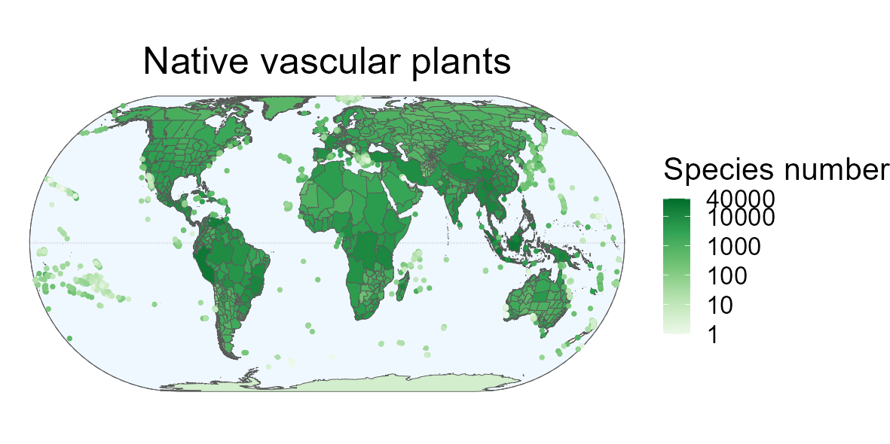

<!-- README.md is generated from README.Rmd. Please edit that file -->

# GIFT 

<!-- badges: start -->

[](https://www.r-project.org/Licenses/GPL-3)
[](https://github.com/BioGeoMacro/GIFT/actions/workflows/pkgdown.yaml)


[](https://doi.org/10.5281/zenodo.10161624)  
<!-- badges: end -->

This **R package** includes several functions for extracting data from
the Global Inventory of Floras and Traits (**GIFT**) database. <br>
**GIFT** is a global database of plant checklists, covering several
taxonomic groups and providing information on the floristic status and
functional traits of plants as well as environmental information for
each checklist. <br> More details on the contents of this database can
be found in the publications by [Weigelt et al.,
(2020)](https://doi.org/10.1111/jbi.13623) and [Denelle et al.,
(2023)](https://doi.org/10.1111/2041-210X.14213).



# :arrow_double_down: Installation

The package is available on CRAN, you can install and load it using the
following commands:

``` r
install.packages("GIFT")
library("GIFT")
```

GIFT is still under active development. You can install the development
version from the GitHub repository using the following commands:

``` r
# install.packages("devtools")
remotes::install_github("https://github.com/BioGeoMacro/GIFT",
dependencies = TRUE)
library("GIFT")
```

# :scroll: Vignettes

We have written several vignettes to help you use the **GIFT R
package**. Three vignettes are available: <br>

- **[Main
  tutorial](https://biogeomacro.github.io/GIFT/articles/GIFT.html)**  
- **[For advanced
  users](https://biogeomacro.github.io/GIFT/articles/GIFT_advanced_users.html)**  
- **[API](https://biogeomacro.github.io/GIFT/articles/GIFT_API.html)**

Alternatively, if you prefer to view the vignettes in R, you can install
the package with `build_vignettes = TRUE`.

``` r
remotes::install_github("https://github.com/BioGeoMacro/GIFT", 
                        dependencies = TRUE, upgrade = "ask", 
                        build_vignettes = TRUE)

vignette("GIFT")
```

# :desktop_computer: Functions

An overview of all functions and data is given
**[here](https://biogeomacro.github.io/GIFT/reference/index.html)**.

# :bug: Find a bug?

Thank you for finding it. Head over to the GitHub Issues tab and let us
know about it. Alternatively, you can also send us an email. We will try
to get to it as soon as possible!

# References and dependencies

`GIFT` depends on `ape`, `dplyr`, `jsonlite`, `phytools`, `purrr`, `sf`,
`stats`, `tidyr` and `utils`.

Denelle, P., Weigelt, P., & Kreft, H. (2023). GIFT—An R package to
access the Global Inventory of Floras and Traits. *Methods in Ecology
and Evolution*, 14, 2738-2748.
<https://doi.org/10.1111/2041-210X.14213>.

Weigelt, P., König, C. & Kreft, H. (2020) GIFT – A Global Inventory of
Floras and Traits for macroecology and biogeography. *Journal of
Biogeography*, <https://doi.org/10.1111/jbi.13623>.
