# GIFT tutorial


  

The Global Inventory of Floras and Traits (GIFT) is a database of floras
and plant checklists, distributed worldwide. It also includes trait and
phylogenetic information. The GIFT R package grants an access to the
GIFT database.  
This vignette illustrates the most common uses of the package with
detailed examples.

1.  Retrieving plant checklists within a given area (example:
    Mediterranean)  
2.  Getting the distribution of a plant species  
3.  Retrieving trait information for a subset of plant species  
4.  Retrieving environmental information for a list of
    polygons/regions  
5.  Retrieving a plant phylogeny and plotting a trait coverage on it

  

The following R packages are required to build this vignette:

``` r
library("GIFT")
library("dplyr")
library("knitr")
library("kableExtra")
library("ggplot2")
library("sf")
library("rnaturalearth")
library("rnaturalearthdata")
library("tidyr")
library("ape")
library("patchwork")
```

  
  

**Side-note**  
Some of the following queries may take a long time to complete
Increasing the timeout makes it easier to complete larger downloads.
This can be done as follows:

``` r
options(timeout = max(1000, getOption("timeout")))
```

  
  

## 1. Checklists for a region

### 1.1. Shapefile

Let’s assume we are interested in having a floristic knowledge of the
western part of the Mediterranean basin. For this purpose, we can simply
use a shape file of the region of interest and feed it to the
[`GIFT_checklists()`](https://biogeomacro.github.io/GIFT/reference/GIFT_checklists.md)
function.

We do provide a shape file of this region in the `GIFT` R package, which
you can access using the `data("western_mediterranean")` command.

``` r
data("western_mediterranean")

world <- ne_coastline(scale = "medium", returnclass = "sf")
world_countries <- ne_countries(scale = "medium", returnclass = "sf")
# Fixing polygons crossing dateline
world <- st_wrap_dateline(world)
world_countries <- st_wrap_dateline(world_countries)

# Eckert IV projection
eckertIV <-
  "+proj=eck4 +lon_0=0 +x_0=0 +y_0=0 +ellps=WGS84 +datum=WGS84 +units=m +no_defs"

ggplot(world) +
  geom_sf(color = "gray50") +
  geom_sf(data = western_mediterranean, fill = "darkblue", color = "black",
          alpha = 0.5, size = 1) +
  labs(title = "Western Mediterranean basin") +
  lims(x = c(-20, 20), y = c(24, 48)) +
  theme_void()
```

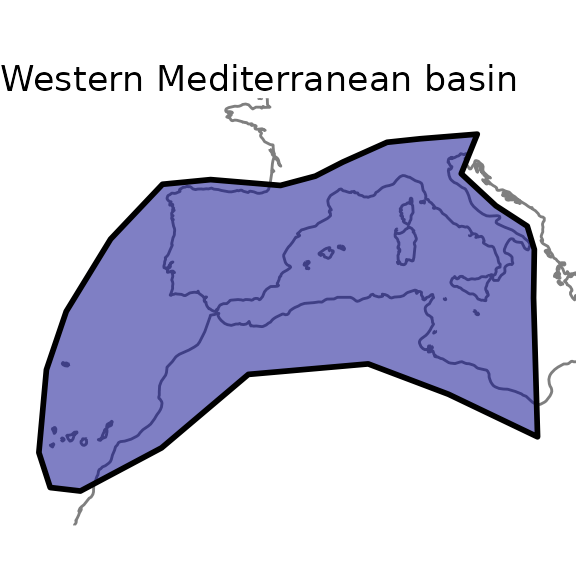

  
*Please note that shapes used in GIFT are unprojected (Geographic
Coordinate* *System WGS84), and that all shapefiles provided should be
in this CRS.* *You can check the coordinate reference system of a sf
object by using* `sf::st_crs().`  

### 1.2. Main arguments

Now that we have a shape for the region of interest, let’s call
[`GIFT_checklists()`](https://biogeomacro.github.io/GIFT/reference/GIFT_checklists.md).
This wrapper function has many arguments, which we detail in this
subsection.  
First, the taxonomic group of interest. We may be interested in a
particular group of plants, say only Angiosperms. In this case, we would
set the `taxon_name` argument like this `taxon_name = "Angiospermae"`.
If we are interested in a particular family of plants, let’s say
orchids, then `taxon_name = "Orchidaceae"`.  
To see all the options for the `taxon_name` argument, you can run the
[`GIFT_taxonomy()`](https://biogeomacro.github.io/GIFT/reference/GIFT_taxonomy.md)
function and look at the `taxon_name` column of its output.  
Along with this first argument comes `complete_taxon`. This argument,
set to TRUE by default, determines whether only regions represented by
checklists in GIFT that completely cover **the taxon of interest**
should be retrieved. Figure 1 illustrates the principle.  
  


Figure 1. Principle of the complete_taxon argument

  
In Figure 1, we want to retrieve checklists of Angiosperms. In the first
available region, region A, only one checklist is of interest. This
checklist is then always retrieved. In region B, there is only one
checklist of orchids, which is only a subset of Angiosperms. If
`complete_taxon` is set to `TRUE`, then this checklist won’t be
retrieved, otherwise yes. Finally, in region C, there is a checklist for
vascular plants and one for orchids. In both cases, the checklist of
vascular plants will be retrieved after filtering out the non-angiosperm
species. The checklist of Orchids is also retrieved in both cases
because it is not the only one available and because it can complete the
floristic knowledge for Angiosperms in this region.  
  
The following arguments of
[`GIFT_checklists()`](https://biogeomacro.github.io/GIFT/reference/GIFT_checklists.md)
refer to the floristic status of plant species. For example, we may be
interested only in endemic or naturalized species. The default value is
to get all native species.  
Similarly, two arguments are needed in the function. First,
`floristic_group` defines the group of interest. Second,
`complete_floristic` indicates whether or not to retrieve incomplete
regions with respect to the selected floristic group. The logic is
detailed in Figure 2 and is similar to the `complete_taxon` argument
shown above

  


Figure 2. Principle of the complete_floristic argument

  

The next set of arguments relate to the spatial match between the
desired area and the GIFT database.  

The main argument in this regard, when providing a shapefile or a set of
coordinates, is the `overlap` argument. This argument can take 4
options, each of which produces different result, as shown in Figure
3.  


Figure 3. Principle of GIFT_spatial()

  

In Figure3, the GIFT polygons shown in orange either intersect, fall
inside or outside the provided shape file. The overlap argument below
each GIFT polygon illustrates in which situation a given GIFT polygon
will or will not be retrieved.

  

Another important spatial feature we provide is the possibility to
remove overlapping polygons. In fact, for many regions of the world,
there are several polygons in the GIFT database that cover them. If
overlapping polygons are not an issue for your case study, you can
simply set `remove_overlap` to FALSE (top right part of Figure 4).
However, if you want to have only one polygon per region, you can set
`remove_overlap` to `TRUE`. In this case, the
[`GIFT_checklists()`](https://biogeomacro.github.io/GIFT/reference/GIFT_checklists.md)
will either retrieve the smaller or the larger polygon. This depends on
the values set for the `area_threshold_mainland` argument as shown in
Figure 4.  


Figure 4. Removing overlapping polygons with remove_overlap argument

  

`area_threshold_mainland` takes a value in $km^{2}$. If the area of the
smaller polygon is less than the threshold, then the larger overlapping
polygon is retrieved (lower left part in Figure 4). If the smaller
polygon exceeds the threshold, then it is retrieved (lower right part of
Figure 4). There is a similar argument for islands,
`area_threshold_island`, which is set to 0 $km^{2}$ by default. This way
the smaller islands are always retrieved by default.  
  
Note also that polygons are considered to overlap if they exceed a
certain percentage of overlap. This percentage can be modified using the
`overlap_threshold` argument (Figure 5). This argument is set by default
to 10%.  


Figure 5. Principle of the overlap_th argument

  

### 1.3. GIFT_checklists()

Now that we have covered the main arguments of
[`GIFT_checklists()`](https://biogeomacro.github.io/GIFT/reference/GIFT_checklists.md),
we can retrieve plant checklists for the Mediterranean region.
[`GIFT_checklists()`](https://biogeomacro.github.io/GIFT/reference/GIFT_checklists.md)
returns a list with two elements. First the metadata of the checklists
matching the different criteria, named `$lists`. The second element is a
`data.frame` of all the checklists with the species composition per
checklist (`$checklists`).  
If you only want to retrieve the metadata, you can set the
`list_set_only` argument to `TRUE`.  

``` r
ex_meta <- GIFT_checklists(taxon_name = "Angiospermae",
                           shp = western_mediterranean,
                           overlap = "centroid_inside",
                           list_set_only = TRUE)
```

  
And to retrieve the species composition:  

``` r
medit <- GIFT_checklists(taxon_name = "Angiospermae",
                         complete_taxon = TRUE,
                         floristic_group = "native",
                         complete_floristic = TRUE,
                         geo_type = "All",
                         shp = western_mediterranean,
                         overlap = "centroid_inside", 
                         remove_overlap = FALSE,
                         taxonomic_group = TRUE) # this argument adds two
# columns to the checklist: plant family and taxonomic group of each species
```

  

We can now have an estimation on the number of checklists with native
Angiosperm species in the western part of the Mediterranean basin, as
well as of the number of species.  

``` r
# Number of references covered
length(unique(medit[[2]]$ref_ID))
#   22 references

# Number of checklists covered (one reference can have several lists inside)
length(unique(medit[[2]]$list_ID))
#   115 checklists

# Number of species
length(unique(medit[[2]]$work_species))
#   12840 plant species
```

  
You can now apply different values for the arguments detailed above. As
you can see, the number of checklists retrieved decreases as you become
stricter on some criteria. For example, when removing overlapping
regions:  

``` r
medit_no_overlap <- GIFT_checklists(shp = western_mediterranean,
                                    overlap = "centroid_inside",
                                    taxon_name = "Angiospermae",
                                    remove_overlap = TRUE)

# Number of references covered
length(unique(medit[[2]]$ref_ID)) # 23 references
length(unique(medit_no_overlap[[2]]$ref_ID)) # 22 references
```

Note that the function not only works with a shape file but can accept a
set of coordinates. The example below illustrates a case where you want
to retrieve GIFT checklists that intersect the coordinates of
Göttingen.  

``` r
custom_point <- cbind(9.9, 51) # coordinates of Göttingen

got <- GIFT_checklists(coordinates = custom_point,
                       overlap = "extent_intersect",
                       taxon_name = "Angiospermae",
                       remove_overlap = TRUE,
                       list_set_only = TRUE)
```

  
  

To cite properly the references retrieved, you can run the function
[`GIFT_references()`](https://biogeomacro.github.io/GIFT/reference/GIFT_references.md)
and look for the column `ref_long`. The column `geo_entity_ref`
associates each reference to a name.

  

### 1.4. Species richness map

Once we have downloaded a set of checklists, it is possible to map the
species richness of the taxonomic group of interest. To do this, we use
a combination of two functions:
[`GIFT_richness()`](https://biogeomacro.github.io/GIFT/reference/GIFT_richness.md)
which returns either species richness or trait coverage per polygon, and
[`GIFT_shapes()`](https://biogeomacro.github.io/GIFT/reference/GIFT_shapes.md)
which returns the shapefile of a list of GIFT polygons.  
The next two chunks illustrate this for the Angiosperms in the World and
in the Western part of the Mediterranean basin.  

``` r
gift_shapes <- GIFT_shapes() # retrieves all shapefiles by default
```

``` r
angio_rich <- GIFT_richness(taxon_name = "Angiospermae")

rich_map <- dplyr::left_join(gift_shapes, angio_rich, by = "entity_ID") %>%
  dplyr::filter(stats::complete.cases(total))

ggplot(world) +
  geom_sf(color = "gray50") +
  geom_sf(data = rich_map, aes(fill = total + 1)) +
  scale_fill_viridis_c("Species number\n(log-transformed)", trans = "log10",
                       labels = scales::number_format(accuracy = 1)) +
  labs(title = "Angiosperms", subtitle = "Projection EckertIV") +
  coord_sf(crs = eckertIV) +
  theme_void()
```

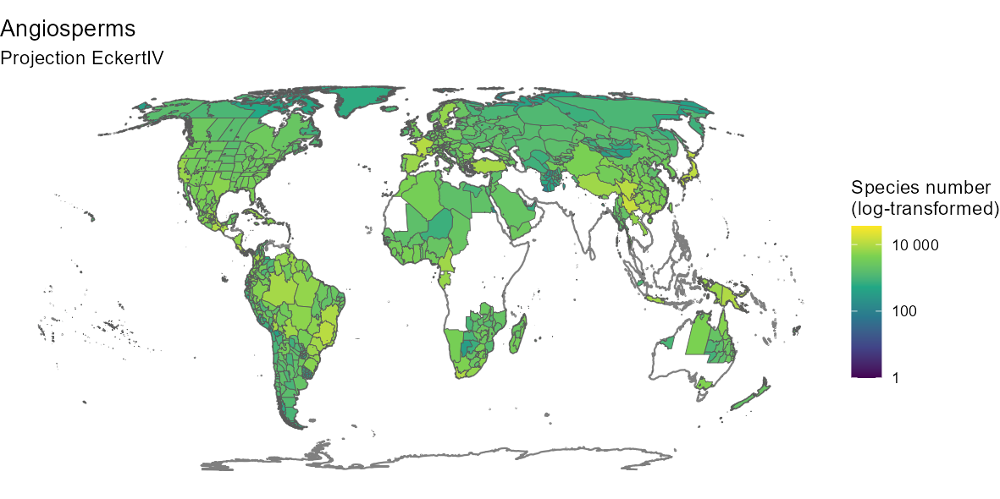

  
By customizing the code above, you can also produce a nicer map:

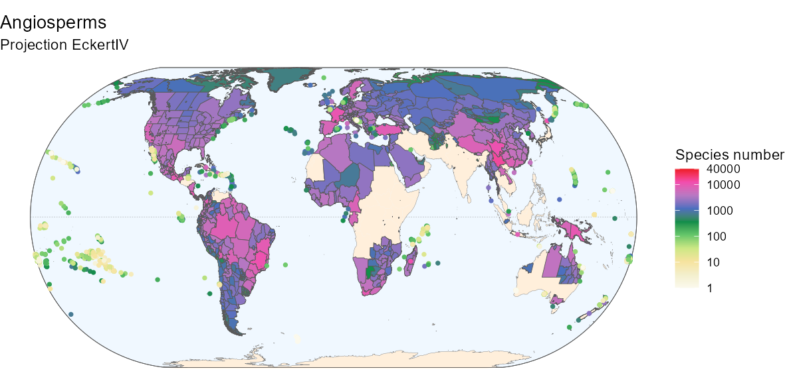

  
Below is the `R` code to produce the above map if interested.  

Fancier code

``` r
# Background box
xmin <- st_bbox(world)[["xmin"]]; xmax <- st_bbox(world)[["xmax"]]
ymin <- st_bbox(world)[["ymin"]]; ymax <- st_bbox(world)[["ymax"]]
bb <- sf::st_union(sf::st_make_grid(st_bbox(c(xmin = xmin,
                                              xmax = xmax,
                                              ymax = ymax,
                                              ymin = ymin),
                                            crs = st_crs(4326)),
                                    n = 100))

# Equator line
equator <- st_linestring(matrix(c(-180, 0, 180, 0), ncol = 2, byrow = TRUE))
equator <- st_sfc(equator, crs = st_crs(world))

# Color code from Barthlott 2007
hexcode_barthlott2007 <- c("#fbf9ed", "#f3efcc", "#f6e39e", "#cbe784",
                           "#65c66a", "#0e8d4a", "#4a6fbf",
                           "#b877c2", "#f24dae", "#ed1c24")

ggplot(world) +
  geom_sf(data = bb, fill = "aliceblue") +
  geom_sf(data = equator, color = "gray50", linetype = "dashed",
          linewidth = 0.1) +
  geom_sf(data = world_countries, fill = "antiquewhite1", color = NA) +
  geom_sf(color = "gray50", linewidth = 0.1) +
  geom_sf(data = bb, fill = NA) +
  geom_sf(data = rich_map,
          aes(fill = ifelse(rich_map$entity_class %in%
                              c("Island/Mainland", "Mainland",
                                "Island Group", "Island Part"),
                            total + 1, NA)),
          size = 0.1) +
  geom_point(data = rich_map,
             aes(color = ifelse(rich_map$entity_class %in%
                                  c("Island"),
                                total + 1, NA),
                 geometry = geometry),
             stat = "sf_coordinates", size = 1, stroke = 0.5) +
  scale_color_gradientn(
    "Species number", trans = "log10", limits = c(1, 40000), 
    colours = hexcode_barthlott2007,
    breaks = c(1, 10, 100, 1000, 10000, 40000),
    labels = c(1, 10, 100, 1000, 10000, 40000),
    na.value = "transparent") +
  scale_fill_gradientn(
    "Species number", trans = "log10", limits = c(1, 40000), 
    colours = hexcode_barthlott2007,
    breaks = c(1, 10, 100, 1000, 10000, 40000),
    labels = c(1, 10, 100, 1000, 10000, 40000),
    na.value = "transparent") +
  labs(title = "Angiosperms", subtitle = "Projection EckertIV") +
  coord_sf(crs = eckertIV) +
  theme_void()
```

  
  

We can also produce maps of richness at intermediate scales. Here is the
code and the map of Angiosperms in the Western Mediterranean basin.  
  

``` r
med_shape <- gift_shapes[which(gift_shapes$entity_ID %in% 
                                 unique(medit[[2]]$entity_ID)), ]

med_rich <- angio_rich[which(angio_rich$entity_ID %in% 
                               unique(medit[[2]]$entity_ID)), ]

med_map <- dplyr::left_join(med_shape, med_rich, by = "entity_ID") %>%
  dplyr::filter(stats::complete.cases(total))

ggplot(world) +
  geom_sf(color = "gray50") +
  geom_sf(data = western_mediterranean,
          fill = "darkblue", color = "black", alpha = 0.1, size = 1) +
  geom_sf(data = med_map, aes(fill = total)) +
  scale_fill_viridis_c("Species number") +
  labs(title = "Angiosperms in the Western Mediterranean basin") +
  lims(x = c(-20, 20), y = c(24, 48)) +
  theme_void()
```

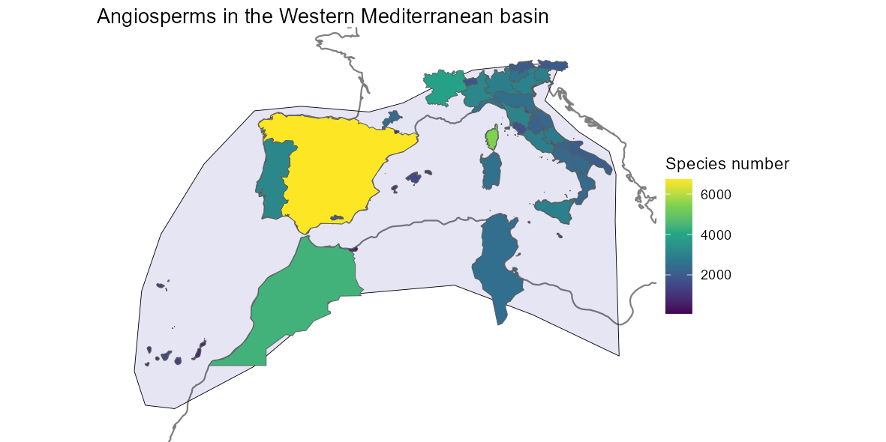

  
  

## 2. Distribution of species

The `GIFT` `R` package also allows for retrieving the spatial
distribution of a focal plant species.  

### 2.1. Available species

To know what plant species are available, you can first run the function
[`GIFT_species()`](https://biogeomacro.github.io/GIFT/reference/GIFT_species.md).

``` r
all_sp <- GIFT_species()
```

364571 species are currently available in the database. This number may
increase with new releases of the database. See the [dedicated
section](https://biogeomacro.github.io/GIFT/articles/GIFT_advanced_users.html#species)
in the advanced vignettes for more details.

### 2.2. Species names and taxonomic harmonization

Since GIFT is a collection of checklists in which authors use their own
taxonomic knowledge to describe species, there is a step of taxonomic
harmonization when including checklists in the database. The most
commonly used backbone is the [World Checklists of Vascular Plants
(WCVP)](https://powo.science.kew.org/).  
Both original and harmonized names are stored in the database and you
can use the
[`GIFT_species_lookup()`](https://biogeomacro.github.io/GIFT/reference/GIFT_species_lookup.md)
function to look up the differences for particular species. For example,
the wood anemone *Anemonoides nemorosa*.  

``` r
anemone_lookup <- GIFT_species_lookup(genus = "Anemonoides",
                                      epithet = "nemorosa")

kable(anemone_lookup, "html") %>%
  kable_styling(full_width = FALSE)
```

| name_ID | genus       | species_epithet | subtaxon | author     | matched | epithetscore | overallscore | resolved | synonym | matched_subtaxon | accepted | service   | work_ID | taxon_ID | work_genus  | work_species_epithet | work_species         | work_author |
|--------:|:------------|:----------------|:---------|:-----------|--------:|-------------:|-------------:|---------:|--------:|-----------------:|---------:|:----------|--------:|---------:|:------------|:---------------------|:---------------------|:------------|
|    3719 | Anemone     | nemorosa        | NA       | L.         |       1 |            1 |        1.000 |        1 |       1 |                0 |        1 | GIFT_wcvp |  438440 |    15034 | Anemonoides | nemorosa             | Anemonoides nemorosa | (L.) Holub  |
|  526917 | Anemonoides | nemorosa        | NA       | (L.) Holub |       1 |            1 |        1.000 |        1 |       0 |                0 |        1 | GIFT_wcvp |  438440 |    15034 | Anemonoides | nemorosa             | Anemonoides nemorosa | (L.) Holub  |
|  772823 | Anemonoides | nemorosa        | NA       | NA         |       1 |            1 |        0.645 |        1 |       0 |                0 |        1 | GIFT_wcvp |  438440 |    15034 | Anemonoides | nemorosa             | Anemonoides nemorosa | (L.) Holub  |

Looking at the output table, you can see the original species names and
their identification numbers (`name_ID`) **before** taxonomic
harmonization. The species names and IDs **after** taxonomic
harmonization are the last columns on the right starting with the prefix
`work_`.

  
  

**Important note**  
The biogeographic statuses assigned to species and regions are always
tied to the original sources. Since species names may change due to
synonymity after taxonomic standardization, the biogeographic statuses
may no longer be valid. Therefore, users should always double-check
these statuses.

The following figure illustrates endemism:

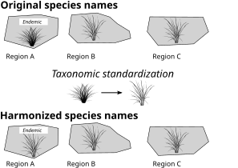

### 2.3. Species distribution

  
Now that we have a focal species and its harmonized name, we can
retrieve its distribution using
[`GIFT_species_distribution()`](https://biogeomacro.github.io/GIFT/reference/GIFT_species_distribution.md).  
Note that here we set the `aggregation` argument to `TRUE` in order to
have only one floristic status per polygon. See the function’s help page
for more details.  

``` r
anemone_distr <- GIFT_species_distribution(
  genus = "Anemonoides", epithet = "nemorosa", aggregation = TRUE)

anemone_statuses <- anemone_distr %>%
  mutate(native = ifelse(native == 1, "native", "non-native"),
         naturalized = ifelse(naturalized == 1, "naturalized",
                              "non-naturalized"),
         endemic_list = ifelse(endemic_list == 1, "endemic_list",
                               "non-endemic_list")) %>%
  dplyr::select(entity_ID, native, naturalized, endemic_list)

table(anemone_statuses$endemic_list)
```

    ## 
    ## non-endemic_list 
    ##               46

This species is not listed as endemic in any of the GIFT polygons. Let’s
check the places where it is listed as native or naturalized.  

``` r
table(paste(anemone_statuses$native, anemone_statuses$naturalized,
            sep = "_"))
```

    ## 
    ##                      NA_NA                  native_NA 
    ##                          6                         12 
    ##     native_non-naturalized              non-native_NA 
    ##                         99                          1 
    ##     non-native_naturalized non-native_non-naturalized 
    ##                          4                          2

Looking at the different combinations of statuses, we can distinguish
several situations: in 13 polygons, there is no status available. The
species is listed as native and non-naturalized (or naturalized status
is missing) in 99+12=111 polygons. It is naturalized and non native in 5
polygons.  
More surprising are the cases where the species is non-native and
non-naturalized, which happens in 2 polygons. This particular
combination can occur in unstable cases where the species is in the
process of becoming naturalized.  

Now that we know in which polygons the species occurs and with what
status, we can map its distribution using the GIFT shapes we retrieved
earlier with
[`GIFT_shapes()`](https://biogeomacro.github.io/GIFT/reference/GIFT_shapes.md).

``` r
# We rename the statuses based on the distinct combinations
anemone_statuses <- anemone_statuses %>%
  mutate(Status = case_when(
    native == "native" & naturalized == "non-naturalized" ~ "native",
    native == "native" & is.na(naturalized) ~ "native",
    native == "non-native" & is.na(naturalized) ~ "non-native",
    native == "non-native" & naturalized == "naturalized" ~ "naturalized",
    native == "non-native" & naturalized == "non-naturalized" ~ "non-native",
    is.na(native) & is.na(naturalized) ~ "unknown"
  ))

# Merge with the shapes
anemone_shape <- gift_shapes[which(gift_shapes$entity_ID %in% 
                                     unique(anemone_distr$entity_ID)), ]
anemone_map <- dplyr::left_join(anemone_shape, anemone_statuses,
                                by = "entity_ID")

# Area of distribution with floristic status
ggplot(world) +
  geom_sf(color = "gray70") +
  geom_sf(data = anemone_map, color = "black", aes(fill = as.factor(Status))) +
  scale_fill_brewer("Status", palette = "Set2") +
  labs(title = expression(paste("Distribution map of ",
                                italic("Anemonoides nemorosa"))),
       subtitle = "Unprojected (GCS: WGS84)") +
  lims(x = c(-65, 170), y = c(-45, 70)) +
  theme_void()
```

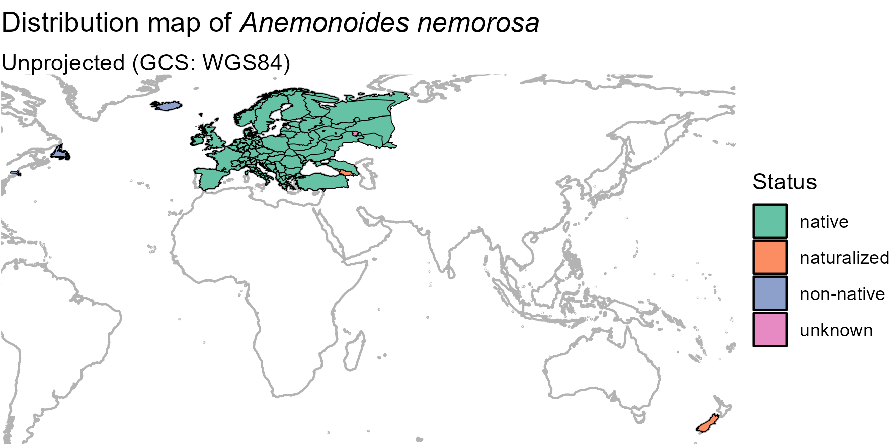

  
By customizing the code above, you can also produce a nicer map:

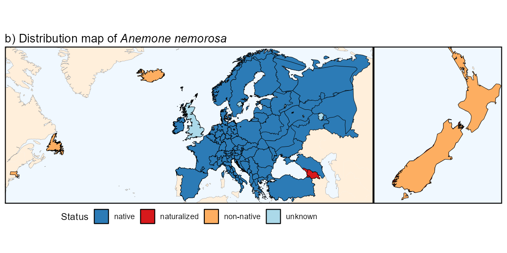

  
Below is the `R` code to produce the above map if interested.  

Fancier code

``` r
anemone_map_plot_bg_parts <-
  ggplot(world) +
  geom_sf(data = bb, fill = "aliceblue", color = NA) +
  geom_sf(data = equator, color = "gray50", linetype = "dashed",
          linewidth = 0.1) +
  geom_sf(data = world_countries, fill = "antiquewhite1", color = NA) +
  geom_sf(color = "gray50", linewidth = 0.1) +
  geom_sf(data = bb, fill = NA) +
  geom_sf(data = anemone_map, color = "black", aes(fill = as.factor(Status))) +
  scale_fill_manual("Status",
                    values = c("native" = "#2c7bb6",
                               "naturalized" = "#d7191c",
                               "non-native" = "#fdae61",
                               "unknown" = "#abd9e9")) +
  labs(title = expression(paste("b) Distribution map of ",
                                italic("Anemonoides nemorosa")))) +
  theme_void() +
  theme(axis.title = element_blank(),
        axis.text = element_blank(),
        axis.ticks = element_blank())

(anemone_map_plot_bg_parts +
    lims(x = c(-69, 61), y = c(37, 70)) + # Europe & Newfoundland
    theme(panel.border = element_rect(fill = NA, linewidth = 1)) +
    theme(legend.position = "bottom")
  |
    anemone_map_plot_bg_parts +
    lims(x = c(165, 178), y = c(-47, -35)) + # New Zealand
    labs(title = "") +
    guides(fill = "none") +
    theme(panel.border = element_rect(fill = NA, linewidth = 1)))
```

  

  
  

## 3. Trait data

Trait information at the species or at a higher taxonomic level is also
provided in the `GIFT` R package.  

### 3.1. Metadata

  
There are many functional traits available in GIFT. Each of these traits
has an identification number called `trait_ID`. Since the two functions
for retrieving trait values,
[`GIFT_traits()`](https://biogeomacro.github.io/GIFT/reference/GIFT_traits.md)
and
[`GIFT_traits_raw()`](https://biogeomacro.github.io/GIFT/reference/GIFT_traits_raw.md),
rely on these IDs, the first step is to call the function
[`GIFT_traits_meta()`](https://biogeomacro.github.io/GIFT/reference/GIFT_traits_meta.md)
to know what the ID of the desired trait is.  
For example, let’s say we want to retrieve the maximum vegetative
heights of plant species.  

``` r
trait_meta <- GIFT_traits_meta()
trait_meta[which(trait_meta$Trait2 == "Plant_height_max"), ]
```

    ##    Lvl1   Category Lvl2       Trait1  Lvl3           Trait2 Units    type
    ## 12    1 Morphology  1.6 Plant height 1.6.2 Plant_height_max     m numeric
    ##    comment count
    ## 12    <NA> 70367

  
We can see that the ID of this trait is `1.6.2`. Now that we have the
ID, we can use
[`GIFT_traits()`](https://biogeomacro.github.io/GIFT/reference/GIFT_traits.md)
to retrieve the growth form values for different plant species.

  

### 3.2. Trait values

#### 3.2.1. Species level

There are two functions to access trait values. First,
[`GIFT_traits_raw()`](https://biogeomacro.github.io/GIFT/reference/GIFT_traits_raw.md)
returns all trait values for a given species and a given trait. These
trait values can then vary.  
Second,
[`GIFT_traits()`](https://biogeomacro.github.io/GIFT/reference/GIFT_traits.md)
returns an aggregated trait value at the species level. The aggregation
simply takes the mean for continuous traits or the most frequent entry
for categorical traits. However, for some specific cases, the
aggregation takes either the minimum (e.g. Plant_height_min,
Shoot_length_min, DBH_min, Seed_length_min, … )or the maximum
(Plant_height_max, …).  
Let’s retrieve the raw and aggregated values for the maximum vegetative
height of plants (trait_ID 1.6.2).  

``` r
height <- GIFT_traits(trait_IDs = c("1.6.2"), agreement = 0.66,
                      bias_ref = FALSE, bias_deriv = FALSE)

height_raw <- GIFT_traits_raw(trait_IDs = c("1.6.2"))

# Raw values
as.numeric(height_raw[which(height_raw$work_species == "Fagus sylvatica"),
                      "trait_value"])

# Aggregated value
as.numeric(height[which(height$work_species == "Fagus sylvatica"),
                  "trait_value_1.6.2"])
```

There were three maximum heights for *Fagus sylvatica*, 30, 35, and 50
meters, which led to an aggregated value of 50 meters.  
And if you want to look up the references that led to the aggregated
trait value, you can run this chunk:

``` r
references <- GIFT_references(GIFT_version = "beta")

unique(unlist(strsplit(height$references_1.6.2, ",")))

references <- references[
  which(references$ref_ID %in% 
          unique(unlist(strsplit(height$references_1.6.2, ",")))), ]
references[1:2, ]
```

  

#### 3.2.2. Taxonomic level

Traits can also be retrieved at a higher taxonomic level, using
[`GIFT_traits_tax()`](https://biogeomacro.github.io/GIFT/reference/GIFT_traits_tax.md).  
As an example, we here attempt to retrieve three traits at the family
level. The three traits asked are woodiness (`trait_ID = "1.1.1"`),
growth form (`trait_ID = "1.2.1"`) and whether the plant is a climber
(`trait_ID = "1.4.1"`).

``` r
trait_tax <- GIFT_traits_tax(trait_IDs = c("1.1.1", "1.2.1", "1.4.1"),
                             bias_ref = FALSE, bias_deriv = FALSE)

trait_tax[1:3, ]
```

Of the three requested traits, the growth form was not available at the
family level. Therefore, the output table contains trait values for the
other two traits at the family level.

  

### 3.3. Trait coverage

We can also retrieve trait coverage information for polygons, using the
same function as for species richness
[`GIFT_coverage()`](https://biogeomacro.github.io/GIFT/reference/GIFT_coverage.md).  
In combination with the previously loaded shapes, we can also map the
trait coverage.  

``` r
angio_height <- GIFT_coverage(what = "trait_coverage",
                              taxon_name = "Angiospermae",
                              trait_ID = "1.6.2")

angio_height_shape <- gift_shapes[which(gift_shapes$entity_ID %in% 
                                          unique(angio_height$entity_ID)), ]

angio_height_map <- dplyr::left_join(
  angio_height_shape, angio_height, by = "entity_ID")

angio_height_map <- angio_height_map[complete.cases(angio_height_map$native), ]

ggplot(world) +
  geom_sf(color = "gray50") +
  geom_sf(data = angio_height_map[complete.cases(angio_height_map$native), ],
          aes(fill = native)) +
  scale_fill_viridis_c("Coverage (%)") +
  labs(title = "Coverage for maximal vegetative height of Angiosperms",
       subtitle = "Projection EckertIV") +
  coord_sf(crs = eckertIV) +
  theme_void()
```

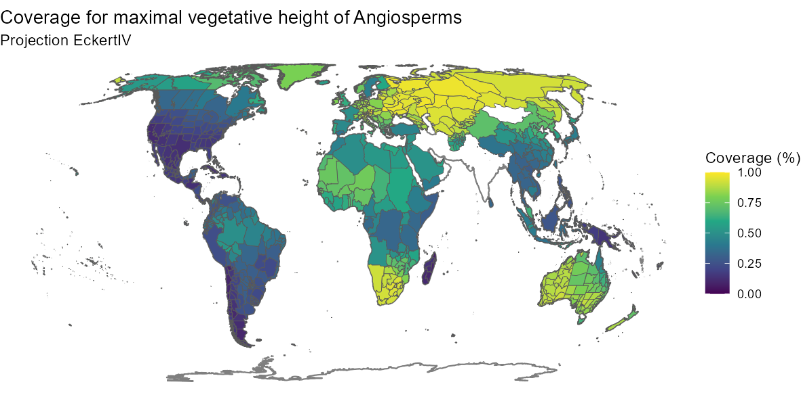

  
By customizing the code above, you can also produce a nicer map:

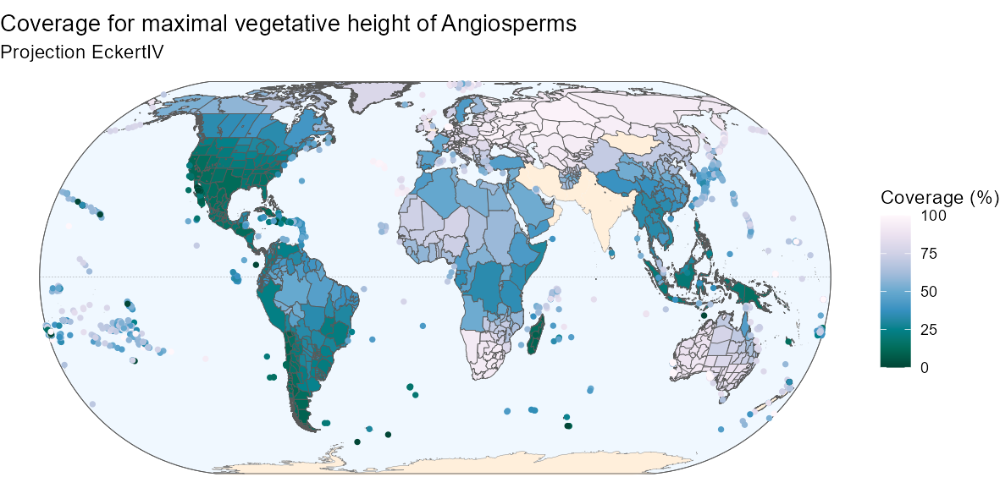

  
Below is the `R` code to produce the above map if interested.  

Fancier code

``` r
ggplot(world) +
  geom_sf(data = bb, fill = "aliceblue") +
  geom_sf(data = equator, color = "gray50", linetype = "dashed",
          linewidth = 0.1) +
  geom_sf(data = world_countries, fill = "antiquewhite1", color = NA) +
  geom_sf(color = "gray50", linewidth = 0.1) +
  geom_sf(data = bb, fill = NA) +
  geom_sf(data = angio_height_map,
          aes(fill = ifelse(angio_height_map$entity_class %in%
                              c("Island/Mainland", "Mainland",
                                "Island Group", "Island Part"),
                            100*native, NA)), size = 0.1) +
  geom_point(data = angio_height_map,
             aes(color = ifelse(angio_height_map$entity_class %in%
                                  c("Island"),
                                100*native, NA),
                 geometry = geometry),
             stat = "sf_coordinates", size = 1, stroke = 0.5) +
  scale_color_gradientn(
    "Coverage (%)", 
    colours = rev(RColorBrewer::brewer.pal(9, name = "PuBuGn")),
    limits = c(0, 100),
    na.value = "transparent") +
  scale_fill_gradientn(
    "Coverage (%)", 
    colours = rev(RColorBrewer::brewer.pal(9, name = "PuBuGn")),
    limits = c(0, 100),
    na.value = "transparent") +
  labs(title = "Coverage for maximal vegetative height of Angiosperms",
       subtitle = "Projection EckertIV") +
  coord_sf(crs = eckertIV) +
  theme_void()
```

  

  
  

## 4. Environmental variables

Finally, a set of summary statistics for many environmental variables
can be retrieved for each GIFT polygon.

### 4.1. Metadata

We here illustrate how to retrieve environmental variables, summarized
at the polygon level, for a subset of polygons.  
We here retrieve environmental variables for the polygons falling into
the western Mediterranean basin, retrieved in the section 1.  
To know what variables are available, you can run these two metadata
functions:
[`GIFT_env_meta_misc()`](https://biogeomacro.github.io/GIFT/reference/GIFT_env_meta_misc.md)
and
[`GIFT_env_meta_raster()`](https://biogeomacro.github.io/GIFT/reference/GIFT_env_meta_raster.md).
They respectively give access to the list of miscellaneous variables and
raster layers available in the GIFT database.  
The references to cite when using environmental variables are also
available through these functions (column `ref_long` of the outputs).  
  

``` r
misc_env <- GIFT_env_meta_misc()
raster_env <- GIFT_env_meta_raster()
```

  

### 4.2. Environmental values

Let’s say we want to retrieve the perimeter and biome of each polygon as
well as elevation and mean temperature. For these two raster layers, we
need to define summary statistics, since the polygons are usually larger
than the raster resolution.  
There are many summary statistics available, you can check the help page
of
[`GIFT_env()`](https://biogeomacro.github.io/GIFT/reference/GIFT_env.md)
to see them all. Let’s get the mean and median of the elevation and the
maximal value of the average temperature.  

``` r
med_env <- GIFT_env(entity_ID = unique(medit[[2]]$entity_ID),
                    miscellaneous = c("perimeter", "biome"),
                    rasterlayer = c("mn30_grd", "wc2.0_bio_30s_01"),
                    sumstat = list(c("mean", "med"), "max"))

med_env[1, ]
```

We see here that the region of El Hierro has an average altitude of 579
meters above sea level and an average annual temperature of 21.6 degrees
Celsius.

  

### 4.3. Map

Using the previously loaded shapes, we can also map a specific
environmental variable for all GIFT polygons.

``` r
world_temp <- GIFT_env(entity_ID = unique(angio_rich$entity_ID),
                       rasterlayer = c("wc2.0_bio_30s_01"),
                       sumstat = c("mean"))

temp_shape <- gift_shapes[which(gift_shapes$entity_ID %in% 
                                  unique(angio_rich$entity_ID)), ]

temp_map <- dplyr::left_join(temp_shape, world_temp, by = "entity_ID")

ggplot(world) +
  geom_sf(color = "gray50") +
  geom_sf(data = temp_map, aes(fill = mean_wc2.0_bio_30s_01)) +
  scale_fill_viridis_c("Celsius degrees") +
  labs(title = "Average temperature",
       subtitle = "Projection EckertIV") +
  coord_sf(crs = eckertIV) +
  theme_void()
```

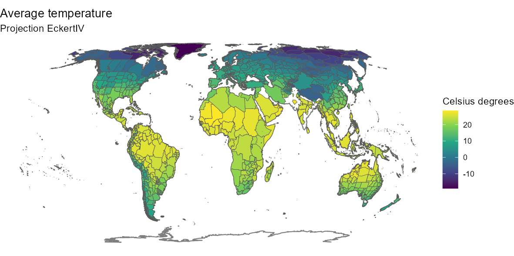

  
By customizing the code above, you can also produce a nicer map:

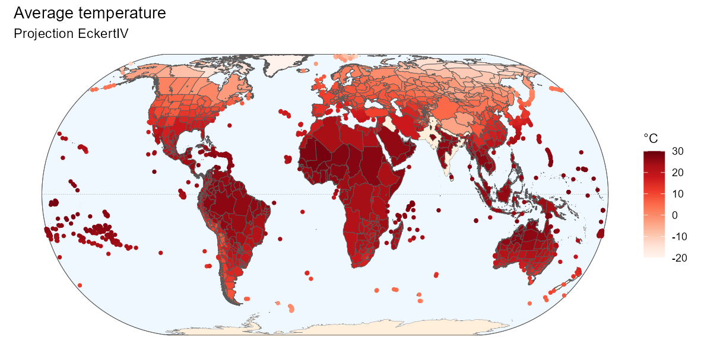

  
Below is the `R` code to produce the above map if interested.  

Fancier code

``` r
ggplot(world) +
  geom_sf(data = bb, fill = "aliceblue") +
  geom_sf(data = equator, color = "gray50", linetype = "dashed",
          linewidth = 0.1) +
  geom_sf(data = world_countries, fill = "antiquewhite1", color = NA) +
  geom_sf(color = "gray50", linewidth = 0.1) +
  geom_sf(data = bb, fill = NA) +
  geom_sf(data = temp_map,
          aes(fill = ifelse(temp_map$entity_class %in%
                              c("Island/Mainland", "Mainland",
                                "Island Group", "Island Part"),
                            mean_wc2.0_bio_30s_01, NA)), size = 0.1) +
  geom_point(data = temp_map,
             aes(color = ifelse(temp_map$entity_class %in%
                                  c("Island"),
                                mean_wc2.0_bio_30s_01, NA),
                 geometry = geometry),
             stat = "sf_coordinates", size = 1, stroke = 0.5) +
  scale_color_gradientn(
    "°C", 
    colours = RColorBrewer::brewer.pal(9, name = "Reds"),
    limits = c(-20, 30),
    na.value = "transparent") +
  scale_fill_gradientn(
    "°C", 
    colours = RColorBrewer::brewer.pal(9, name = "Reds"),
    limits = c(-20, 30),
    na.value = "transparent") +
  labs(title = "Average temperature",
       subtitle = "Projection EckertIV") +
  coord_sf(crs = eckertIV) +
  theme_void()
```

  

  
  

## 5. Phylogeny

To build a phylogeny for all species in the GIFT database, we have used
the U.PhyloMaker R package [Jin & Qian
(2022)](https://doi.org/10.1016/j.pld.2022.12.007). For seed plants, we
selected the megatree GBOTB.extended.WP.tre by [Smith and Brown
(2018)](https://doi.org/10.1002/ajb2.1019) and the phylogeny for
pteridophytes in [Zanne et
al. (2014)](https://www.nature.com/articles/nature12872).

``` r
# Retrieving phylogeny, taxonomy and species from GIFT
phy <- GIFT_phylogeny(clade = "Tracheophyta", GIFT_version = "beta")
tax <- GIFT_taxonomy(GIFT_version = "beta")
gift_sp <- GIFT_species(GIFT_version = "beta")

gf <- GIFT_traits(trait_IDs = "1.2.1", agreement = 0.66, bias_ref = FALSE,
                  bias_deriv = FALSE, GIFT_version = "beta")
```

``` r
# Replacing space with _ for the species names
gf$work_species <- gsub(" ", "_", gf$work_species, fixed = TRUE)
```

``` r
# Retrieving family of each species
sp_fam <- GIFT_taxgroup(work_ID = unique(gift_sp$work_ID),
                        taxon_lvl = "family", GIFT_version = "beta")
sp_genus_fam <- data.frame(
  work_ID = unique(gift_sp$work_ID),
  work_species = unique(gift_sp$work_species),
  family = sp_fam)
sp_genus_fam <- left_join(sp_genus_fam,
                          gift_sp[, c("work_ID", "work_genus")],
                          by = "work_ID")
colnames(sp_genus_fam)[colnames(sp_genus_fam) == "work_genus"] <- "genus"

# Problem with hybrid species on the tip labels of the phylo tree
phy$tip.label[substring(phy$tip.label, 1, 2) == "x_"] <-
  substring(phy$tip.label[substring(phy$tip.label, 1, 2) == "x_"],
            3,
            nchar(phy$tip.label[substring(phy$tip.label, 1, 2) == "×_"]))

phy$tip.label[substring(phy$tip.label, 1, 2) == "×_"] <-
  substring(phy$tip.label[substring(phy$tip.label, 1, 2) == "×_"],
            3,
            nchar(phy$tip.label[substring(phy$tip.label, 1, 2) == "×_"]))
```

In the next chunk, we calculate the trait coverage (for growth form) at
the genus and family level.

``` r
sp_genus_fam <- left_join(sp_genus_fam,
                          gf[, c("work_ID", "trait_value_1.2.1")],
                          by = "work_ID")

genus_gf <- sp_genus_fam %>%
  group_by(genus) %>%
  mutate(prop_gf = round(100*sum(is.na(trait_value_1.2.1))/n(), 2)) %>%
  ungroup() %>%
  dplyr::select(-work_ID, -work_species, -family, -trait_value_1.2.1) %>%
  distinct(.keep_all = TRUE)

fam_gf <- sp_genus_fam %>%
  group_by(family) %>%
  mutate(prop_gf = round(100*sum(is.na(trait_value_1.2.1))/n(), 2)) %>%
  ungroup() %>%
  dplyr::select(-work_ID, -work_species, -genus, -trait_value_1.2.1) %>%
  distinct(.keep_all = TRUE)

sp_genus_fam$species <- gsub("([[:punct:]])|\\s+", "_",
                             sp_genus_fam$work_species)

# Keeping one species per genus only
one_sp_per_gen <- data.frame()
for(i in 1:n_distinct(sp_genus_fam$genus)){ # loop over genera
  # Focal genus
  focal_gen <- unique(sp_genus_fam$genus)[i]
  # All species in that genus
  gen_sp_i <- sp_genus_fam[which(sp_genus_fam$genus == focal_gen),
                           "species"]
  # Species from the genus available in the phylogeny
  gen_sp_i <- gen_sp_i[gen_sp_i %in% phy$tip.label]
  # Taking the first one (if at least one is available)
  gen_sp_i <- gen_sp_i[1]
  
  one_sp_per_gen <- rbind(one_sp_per_gen,
                          data.frame(species = gen_sp_i,
                                     genus = focal_gen))
}

# Adding the trait coverage per genus
one_sp_per_gen <- left_join(one_sp_per_gen, genus_gf, by = "genus")

# Adding the trait coverage per family
one_sp_per_gen <- left_join(one_sp_per_gen,
                            sp_genus_fam[!duplicated(sp_genus_fam$genus),
                                         c("genus", "family")],
                            by = "genus")
colnames(one_sp_per_gen)[colnames(one_sp_per_gen) == "prop_gf"] <-
  "prop_gf_gen"
one_sp_per_gen <- left_join(one_sp_per_gen, fam_gf, by = "family")
colnames(one_sp_per_gen)[colnames(one_sp_per_gen) == "prop_gf"] <-
  "prop_gf_fam"
```

We now prune the tree at the genus level.

``` r
phy_gen <- ape::keep.tip(
  phy = phy,
  tip = one_sp_per_gen[complete.cases(one_sp_per_gen$species), "species"])
```

In the following plot, there is only one tip per genus. The two outer
rings illustrate the coverage of growth form per genus and per family
(outer ring). For the family ring, the width of each family is set by
the number of genera it contains.  
To get the following plot, you need to install/load the following
packages:

``` r
library("BiocManager")
install("ggtree")
library("ggtree")
library("tidytree")
install("ggtreeExtra")
library("ggtreeExtra")
```

  

``` r
ggtree(phy_gen, color = "grey70", layout = "circular") %<+% one_sp_per_gen +
  geom_fruit(geom = geom_tile,
             mapping = aes(fill = prop_gf_gen),
             width = 50,
             offset = 0.1) +
  geom_fruit(geom = geom_tile,
             mapping = aes(color = prop_gf_fam, fill = prop_gf_fam),
             width = 50,
             offset = 0.1,
             show.legend = FALSE) +
  scale_color_viridis_c() +
  scale_fill_viridis_c("Growth form availability per genus (%)") +
  theme(legend.position = "bottom")
```

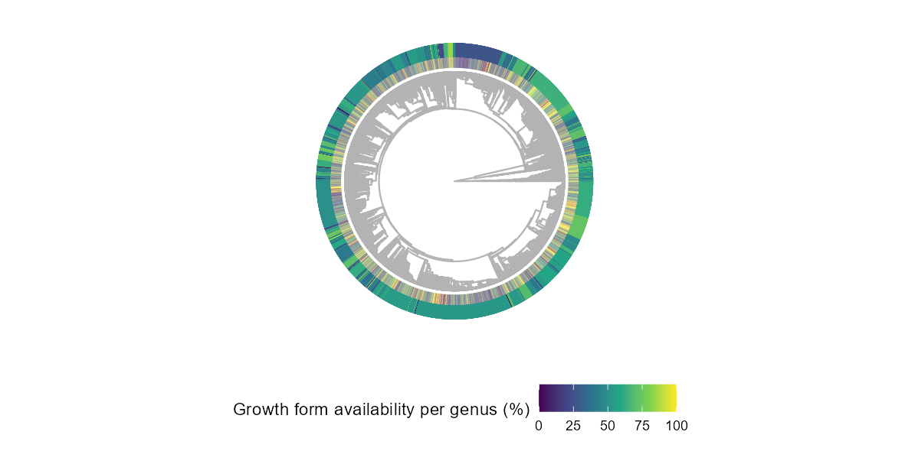

  
  

## 6. References

When using the GIFT database and the GIFT R package, here are the two
resources to cite:

Denelle, P., Weigelt, P., & Kreft, H. (2023). GIFT—An R package to
access the Global Inventory of Floras and Traits. *Methods in Ecology
and Evolution*, 00, 1–11. <https://doi.org/10.1111/2041-210X.14213>.

Weigelt, P., König, C. & Kreft, H. (2020) GIFT – A Global Inventory of
Floras and Traits for macroecology and biogeography. *Journal of
Biogeography*, <https://doi.org/10.1111/jbi.13623>.
