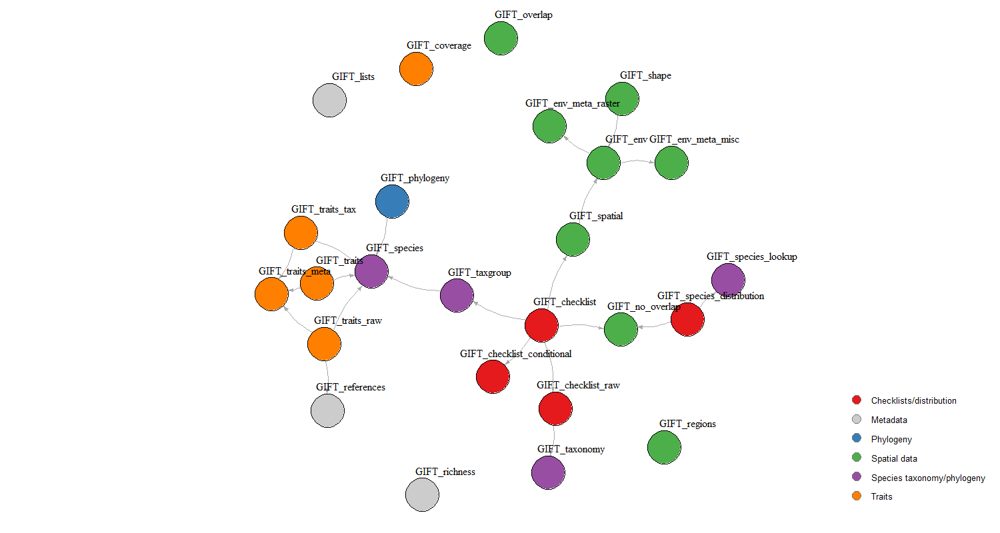

# Queries in the API


  

This vignette shows how to work with the API, how it relates to the GIFT
R package, and how the R functions in the package are interdependent.

  

## API

The API endpoint is
*<https://gift.uni-goettingen.de/api/extended/index.php>*. We then have
several queries, listed in the table below, that allow retrieving
distinct tables. The name in the Query column of the table below has to
be used as the query argument. As an example, here is the query that
leads to the environmental raster metadata table:  
<https://gift.uni-goettingen.de/api/extended/index.php?query=env_raster>

  
Note that the endpoint changes depending on the version of GIFT you are
querying. For example, with the same table as above, we can retrieve the
table as it was in GIFT version 2.0:  
<https://gift.uni-goettingen.de/api/extended/index2.0.php?query=env_raster>

  
While this API does not require authentication, there is a
password-protected API leading to some restricted content in the
different tables. Restricted content can be,for example, some checklists
that need the approval of their provider before being used. This API can
be communicated upon request.

  
Here is the list of the 24 available queries, their arguments and the
GIFT R functions in which they are called. There is no rate-limitation
for any of these queries except for *species* and *phylogeny*, which
retrieves the data in chunks.

| Query | Arguments | R_function |
|:---|:---|:---|
| checklists | listid (integer) , taxonid, namesmatched, filter | GIFT_checklists_raw() |
| env_misc |  | GIFT_env_meta_misc() |
| env_raster |  | GIFT_env_meta_raster() |
| geoentities_env_misc | envvar | GIFT_env() |
| geoentities_env_raster | layername, sumstat | GIFT_env() |
| lists |  | GIFT_lists(), GIFT_checklists_conditional(), GIFT_checklists() |
| names_matched | genus, epithet | GIFT_species_lookup() |
| names_matched_unique | genus, epithet | GIFT_species_lookup() |
| overlap | taxon, startat | GIFT_species_distribution(), GIFT_no_overlap(), GIFT_checklists() |
| overlap_misc | layer | GIFT_overlap() |
| phylogeny | taxon, startat, limit | GIFT_phylogeny() |
| references_citavi |  | GIFT_env_meta_raster(), GIFT_env_meta_misc() |
| references |  | GIFT_references() |
| reference_traits |  | GIFT_traits_raw() |
| regions |  | GIFT_regions() |
| species | startat, limit | GIFT_species() |
| species_distr | nameid | GIFT_species_distribution() |
| species_num | taxonid | GIFT_richness() |
| taxonomy |  | GIFT_taxonomy(), GIFT_taxgroup(), GIFT_richness(), GIFT_checklists_raw(), GIFT_checklists(), GIFT_checklists_conditional() |
| traits | traitid, biasref, biasderiv, startat, limit | GIFT_traits() |
| traits_cov | traitid, taxonid | GIFT_richness() |
| traits_meta |  | GIFT_traits_meta() |
| traits_raw | traitid, deriv, biasderiv, refid | GIFT_traits_raw() |
| versions |  | All GIFT functions |

  
Some more details:

``` r

# Query for trait and chunks
# Default value for end is 10000
# https://gift.uni-goettingen.de/api/extended/index.php?query=traits&
# traitid=1.1.1&biasref=1&biasderiv=1&startat=100000&limit=10

# To retrieve the geojson
paste0("https://gift.uni-goettingen.de/geojson/geojson_smaller", 
       ifelse(GIFT_version == "beta", "", GIFT_version), "/",
       entity_ID[i], ".geojson")
```

## Dependency graph of R functions

Arrows in the figure below connect interdependent functions,
i.e. functions that call other functions. Function names are colored
according to the larger category to which they belong.  



## References

Denelle, P., Weigelt, P., & Kreft, H. (2023). GIFT—An R package to
access the Global Inventory of Floras and Traits. *Methods in Ecology
and Evolution*, 00, 1–11. <https://doi.org/10.1111/2041-210X.14213>.

Weigelt, P., König, C. & Kreft, H. (2020) GIFT – A Global Inventory of
Floras and Traits for macroecology and biogeography. *Journal of
Biogeography*, <https://doi.org/10.1111/jbi.13623>.
