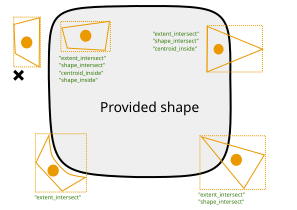
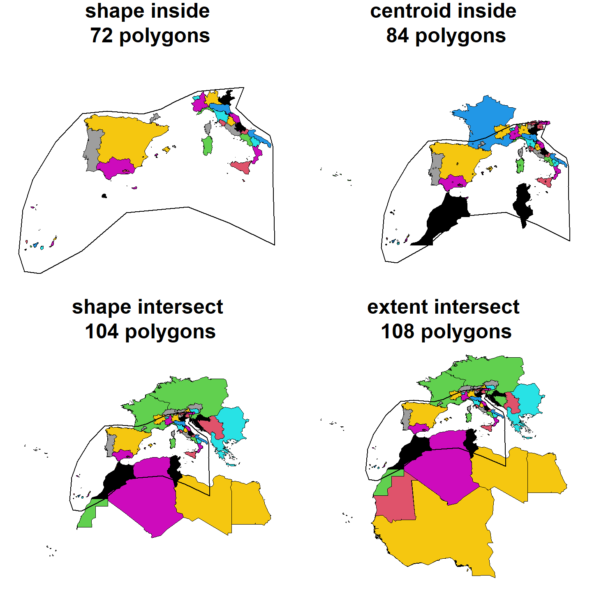
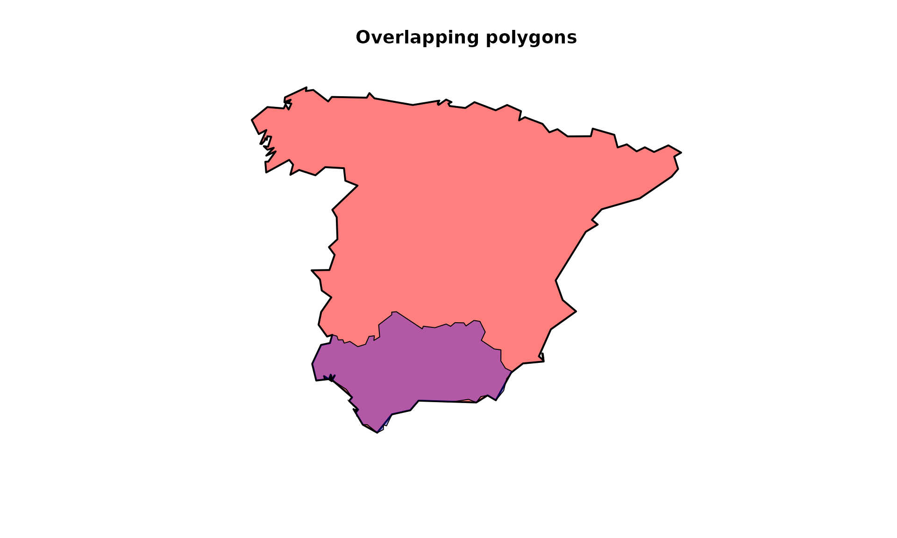
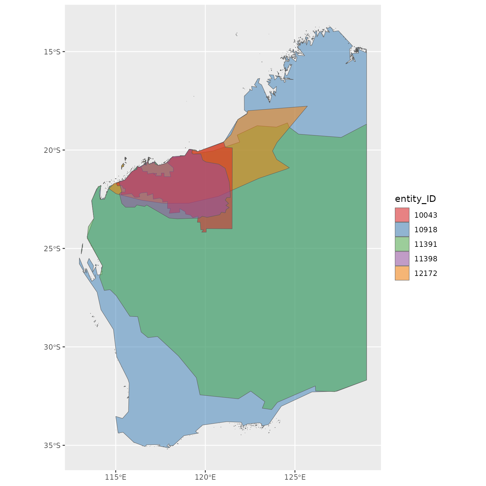
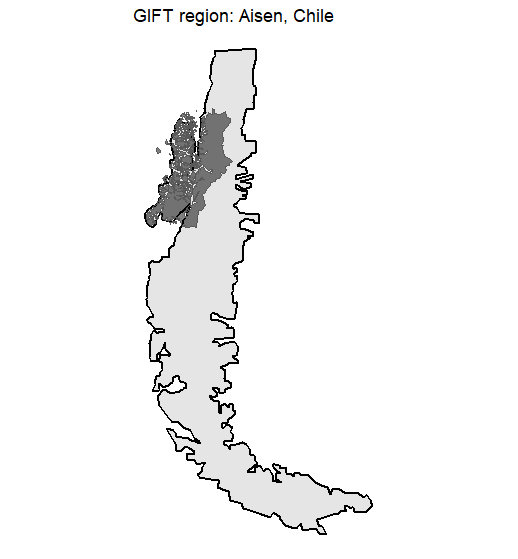
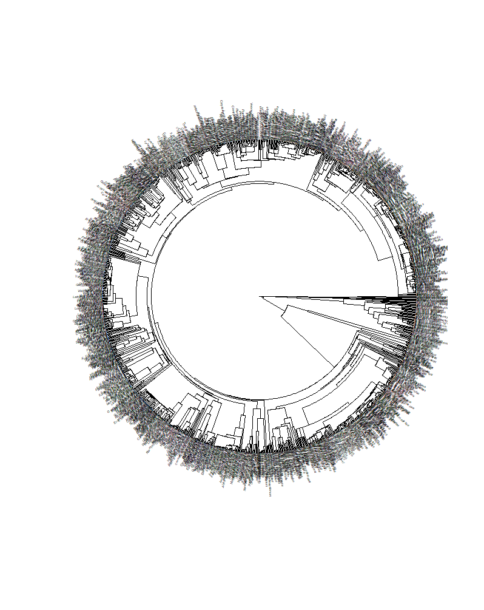

# GIFT tutorial for advanced users


  

This vignette documents some functions and specificities that were not
presented in the [main
vignette](https://biogeomacro.github.io/GIFT/articles/GIFT.html) of the
package. It is mainly intended for advanced users of the GIFT database.

## 1. Versions and metadata for checklists

All functions in the package have a `version` argument. This argument
allows you to retrieve different instances of the GIFT database and thus
make all previous studies using the GIFT database reproducible. For
example, the version used in Weigelt et al. (2020) is `"1.0"`. To get
more information about the contents of the different versions, you can
go [here](https://gift.uni-goettingen.de/about) and click on the Version
Log tab.

To access all the available versions of the database, you can run the
following function:

``` r

versions <- GIFT_versions()
kable(versions, "html") %>%
  kable_styling(full_width = FALSE)
```

| ID | version | description | taxonomy | phylogeny | overlap |
|:---|:---|:---|:---|:---|:---|
| 1 | 1.0 | 2018-08-08: Data included in and workflows used to assemble GIFT 1.0 are described in detail in: Weigelt, P., König, C. & Kreft, H. (2020) GIFT – A Global Inventory of Floras and Traits for macroecology and biogeography. Journal of Biogeography, 47, 16-43. doi: 10.1111/jbi.13623 | The Plant List 1.1 and resources used by TNRS at the time | NA | gaptani (version: okt2005, ID_column: UNITID); glonaf (version: 2017-06-12; ID_column: OBJIDsic); gmba (version: 1.0, ID_column: rownames) |
| 2 | 2.0 | 2019-09-01: New checklist and trait data included for Europe, the Mediterranean, temperate Asia, Panama, Japan, Java, New Zealand, Easter Island and the Torres Strait Islands. Updated workflows to document biases in the distribution of trait data; Updated taxonomic trait derivation; Final trait values and agreement scores for trait values from several resources are now calculated separately including and excluding restricted resources. | The Plant List 1.1 and resources used by TNRS at the time | NA | gaptani (version: okt2005, ID_column: UNITID); glonaf (version: 2017-06-12; ID_column: OBJIDsic); gmba (version: 1.0, ID_column: rownames) |
| 3 | 2.1 | 2021-05-21: New checklists and traits included for the Americas, Crimea, Madagascar, Arabian peninsula, Laos, Bhutan, India, China, Sunda-Sahul shelf, Tonga, Canary Islands, West Africa and for ferns and palms globally. Large categorical trait data included from Try. | The Plant List 1.1 and resources used by TNRS at the time | NA | gaptani (version: okt2005, ID_column: UNITID); glonaf (version: 2017-06-12; ID_column: OBJIDsic); gmba (version: 1.0, ID_column: rownames) |
| 4 | 2.2 | 2022-05-30: New checklists (with a focus on endemic species) and traits for various oceanic archipelagos (Cook Islands, Madeira, Arctic Islands, Cayman Islands, Comores, Juan Fernandez, Palau, Galapagos, Frisian Islands, Antilles, Japan, Mayotte, Fiji, Taiwan, etc.) and various mainland regions (Equatorial Guinea and the entire former USSR in sub-regions). | The Plant List 1.1 and resources used by TNRS at the time | NA | gaptani (version: okt2005, ID_column: UNITID); glonaf (version: 2017-06-12; ID_column: OBJIDsic); gmba (version: 1.0, ID_column: rownames) |
| 5 | 3.0 | 2023-06-30: New data and updated workflows as described in: Denelle, P., Weigelt, P. & Kreft, H. (2023) GIFT - an R package to access the Global Inventory of Floras and Traits. BioRxiv, doi: 10.1101/2023.06.27.546704. Updated workflows include: (1) New taxonomic name standardization based on WCVP; (2) More statistics on species level trait aggregation; (3) Updated extraction of raster layer values per GIFT region and new raster resources; (4) Updated phylogeny. | World Checklist of Vascular Plants (WCVP, v9) and resources used by TNRS at the time | Phylogeny built using U.PhyloMaker R-package (Jin & Qian, 2022) based on the GBOTB megatree from Smith & Brown (2018) and Zanne et al. (2014), standardized according to WCVP. | gaptani (version: okt2005, ID_column: UNITID); glonaf (version: 2021-07-02; ID_column: OBJIDsic); gmba (version: 1.2, ID_column: rownames) |
| 6 | 3.1 | 2023-11-11: New checklist data for Mongolia and Farasan Archipelago and correction of seed traits for Hawaii (ref 16; units). | World Checklist of Vascular Plants (WCVP, v9) and resources used by TNRS at the time | Phylogeny built using U.PhyloMaker R-package (Jin & Qian, 2022) based on the GBOTB megatree from Smith & Brown (2018) and Zanne et al. (2014), standardized according to WCVP. | gaptani (version: okt2005, ID_column: UNITID); glonaf (version: 2021-07-02; ID_column: OBJIDsic); gmba (version: 2.0, ID_column: GMBA_V2_ID) |
| 7 | 3.2 | 2024-06-13: New oceanic archipelago trait data and global parasitism information | World Checklist of Vascular Plants (WCVP, v9) and resources used by TNRS at the time | Phylogeny built using U.PhyloMaker R-package (Jin & Qian, 2022) based on the GBOTB megatree from Smith & Brown (2018) and Zanne et al. (2014), standardized according to WCVP. | gaptani (version: okt2005, ID_column: UNITID); glonaf (version: 2021-07-02; ID_column: OBJIDsic); gmba (version: 2.0, ID_column: GMBA_V2_ID) |

The `version` column of this table is the one to use if you want to
retrieve past versions of the GIFT database. By default, the argument
used is `GIFT_version = "latest"` which leads to the current latest
stable version of the database (“2.0” in October 2022).

The
[`GIFT_lists()`](https://biogeomacro.github.io/GIFT/reference/GIFT_lists.md)
function can be run to retrieve metadata about the GIFT checklists. In
the next chunk, we call it with different values for the `GIFT_version`
argument.

``` r

list_latest <- GIFT_lists(GIFT_version = "latest") # default value
list_1 <- GIFT_lists(GIFT_version = "1.0")
```

The number of available checklists was 3122 in the version 1.0 and
equals 4475 in the version 2.0.

  

## 2. References

When using the GIFT database in a research article, it is a good
practice to cite the references used, and list them in an Appendix. The
following function retrieves the reference for each checklist, as well
as some metadata. References are documented in the `ref_long` column.

``` r

ref <- GIFT_references()
ref <- ref[which(ref$ref_ID %in% c(22, 10333, 10649)),
           c("ref_ID", "ref_long", "geo_entity_ref")]

# 3 first rows of that table
kable(ref, "html") %>%
  kable_styling(full_width = FALSE)
```

|  | ref_ID | ref_long | geo_entity_ref |
|:---|---:|:---|:---|
| 22 | 22 | Kirchner, Picot, Merceron & Gigot (2010) Flore vasculaire de La Réunion. Conservatoire Botanique National de Mascarin, Réunion; France. | La Réunion |
| 667 | 10333 | Zizka (1991) Flowering plants of Easter Island. Palmarum hortus francofurtensis 3, 3-108. | Easter Island |
| 880 | 10649 | Pavlov (1954-1966) Flora Kazakhstana. Nauka Kazakhskoy SSR, Alma-Ata, Kazakhstan. | Kazakhstan |

  

The next chunk describes the steps to retrieve the publication sources
when you start from specific regions, let’s say the Canary islands.

``` r

# List of all regions
regions <- GIFT_regions()

# Example
can <- 1036 # entity ID for Canary islands

# What references
gift_lists <- GIFT_lists()

can_ref <- gift_lists[which(gift_lists$entity_ID %in% c(can)), "ref_ID"]

# What sources
kable(ref[which(ref$ref_ID %in% can_ref), ], "html") %>%
  kable_styling(full_width = TRUE)
```

| ref_ID | ref_long | geo_entity_ref |
|--------|----------|----------------|
|        |          |                |

  

## 3. Checklist data

The main wrapper function for retrieving checklists and their species
composition is
[`GIFT_checklists()`](https://biogeomacro.github.io/GIFT/reference/GIFT_checklists.md)
but you can also retrieve individual checklists using
[`GIFT_checklists_raw()`](https://biogeomacro.github.io/GIFT/reference/GIFT_checklists_raw.md).
You would need to know the identification number `list_ID` of the
checklists you want to retrieve.  
To quickly see all the `list_ID` available in the database, you can run
[`GIFT_lists()`](https://biogeomacro.github.io/GIFT/reference/GIFT_lists.md)
as shown in [Section 1](#section1).

  
When calling
[`GIFT_checklists_raw()`](https://biogeomacro.github.io/GIFT/reference/GIFT_checklists_raw.md),
you can set the argument `namesmatched` to `TRUE` in order to get
additional columns informing about the taxonomic harmonization that was
performed when the list was uploaded to the GIFT database.

``` r

listID_1 <- GIFT_checklists_raw(list_ID = c(11926))
listID_1_tax <- GIFT_checklists_raw(list_ID = c(11926), namesmatched = TRUE)

ncol(listID_1) # 16 columns
ncol(listID_1_tax) # 33 columns
length(unique(listID_1$work_ID)); length(unique(listID_1_tax$orig_ID))
```

In the list we called up, you can see that we “lost” some species after
the taxonomic harmonization since we went from 1331 in the source to
1106 after the taxonomic harmonization. This means that several species
were considered as synonyms or unknown plant species in the taxonomic
backbone used for harmonization.  
  
*Note: the main service used for taxonomic harmonization of species
names* *was The Plant List up to version 2.0 and World checklist of
Vascular Plants* *afterwards.*

  

## 4. Spatial subset

In the [main
vignette](https://biogeomacro.github.io/GIFT/articles/GIFT.html), we
illustrated how to retrieve checklists that fall into a provided
shapefile, using the western Mediterranean basin provided with the GIFT
R package.

``` r

data("western_mediterranean")
```

Here we provide more details on the different values the `overlap`
argument can take, using the
[`GIFT_spatial()`](https://biogeomacro.github.io/GIFT/reference/GIFT_spatial.md)
function. The following figure illustrates how this argument works:

  



Figure 1. GIFT spatial

  

We now illustrate this by retrieving checklists falling in the western
Mediterranean basin using the four options available.

``` r

med_centroid_inside  <- GIFT_spatial(shp = western_mediterranean,
                                     overlap = "centroid_inside")
med_extent_intersect <- GIFT_spatial(shp = western_mediterranean,
                                     overlap = "extent_intersect")
med_shape_intersect <- GIFT_spatial(shp = western_mediterranean,
                                    overlap = "shape_intersect")
med_shape_inside <- GIFT_spatial(shp = western_mediterranean,
                                 overlap = "shape_inside")
```

``` r

length(unique(med_extent_intersect$entity_ID))
length(unique(med_shape_intersect$entity_ID))
length(unique(med_centroid_inside$entity_ID))
length(unique(med_shape_inside$entity_ID))
```

We see here that we progressively lose lists as we apply more selective
criterion on the spatial overlap. The most restrictive option being
`overlap = "shape_inside"` with 72 regions, then
`overlap = "centroid_inside"` with 84 regions,
`overlap = "shape_intersect"` with 104 regions and finally the less
restrictive one being `overlap = "extent_intersect"` with 108 regions.  
Using the functions
[`GIFT_shapes()`](https://biogeomacro.github.io/GIFT/reference/GIFT_shapes.md)
and calling it for the entity_IDs retrieved in each instance, we can
download the shape files for each region.

``` r

geodata_extent_intersect <- GIFT_shapes(med_extent_intersect$entity_ID)

geodata_shape_inside <-
  geodata_extent_intersect[which(geodata_extent_intersect$entity_ID %in%
                                   med_shape_inside$entity_ID), ]
geodata_centroid_inside <-
  geodata_extent_intersect[which(geodata_extent_intersect$entity_ID %in%
                                   med_centroid_inside$entity_ID), ]
geodata_shape_intersect <-
  geodata_extent_intersect[which(geodata_extent_intersect$entity_ID %in%
                                   med_shape_intersect$entity_ID), ]
```

And then make a map.

``` r

par_overlap <- par(mfrow = c(2, 2), mai = c(0, 0, 0.5, 0))
plot(sf::st_geometry(geodata_shape_inside),
     col = geodata_shape_inside$entity_ID,
     main = paste("shape inside\n",
                  length(unique(med_shape_inside$entity_ID)),
                  "polygons"))
plot(sf::st_geometry(western_mediterranean), lwd = 2, add = TRUE)

plot(sf::st_geometry(geodata_centroid_inside),
     col = geodata_centroid_inside$entity_ID,
     main = paste("centroid inside\n",
                  length(unique(med_centroid_inside$entity_ID)),
                  "polygons"))
points(geodata_centroid_inside$point_x, geodata_centroid_inside$point_y)
plot(sf::st_geometry(western_mediterranean), lwd = 2, add = TRUE)

plot(sf::st_geometry(geodata_shape_intersect),
     col = geodata_shape_intersect$entity_ID,
     main = paste("shape intersect\n",
                  length(unique(med_shape_intersect$entity_ID)),
                  "polygons"))
plot(sf::st_geometry(western_mediterranean), lwd = 2, add = TRUE)

plot(sf::st_geometry(geodata_extent_intersect),
     col = geodata_extent_intersect$entity_ID,
     main = paste("extent intersect\n",
                  length(unique(med_extent_intersect$entity_ID)),
                  "polygons"))
plot(sf::st_geometry(western_mediterranean), lwd = 2, add = TRUE)
par(par_overlap)
```



  

## 5. Remove overlapping regions

GIFT comprises many polygons and for some regions, there are several
polygons overlapping. How to remove overlapping polygons and the
associated parameters are two things detailed in the [main
vignette](https://biogeomacro.github.io/GIFT/articles/GIFT.html). We
here provide further details:

``` r

length(med_shape_inside$entity_ID)
```

    ## [1] 72

``` r

length(GIFT_no_overlap(med_shape_inside$entity_ID, area_threshold_island = 0,
                       area_threshold_mainland = 100, overlap_threshold = 0.1))
```

    ## [1] 53

``` r

# The following polygons are overlapping:
GIFT_no_overlap(med_shape_inside$entity_ID, area_threshold_island = 0,
                area_threshold_mainland = 100, overlap_threshold = 0.1)
```

    ##  [1]   145   146   147   148   149   150   151   414   415   416   417   547
    ## [13]   548   549   550   551   552   586   591   592   736   738   739 10001
    ## [25] 10072 10104 10184 10303 10422 10430 10978 11029 11030 11031 11033 11035
    ## [37] 11038 11039 11042 11044 11045 11046 11434 11474 11477 11503 12231 12232
    ## [49] 12233 12632 12633 12634 12635

``` r

# Example of two overlapping polygons: Spain mainland and Andalusia
overlap_shape <- GIFT_shapes(entity_ID = c(10071, 12078))
```

``` r

par_overlap_shp <- par(mfrow = c(1, 1))
plot(sf::st_geometry(overlap_shape),
     col = c(rgb(red = 1, green = 0, blue = 0, alpha = 0.5),
             rgb(red = 0, green = 0, blue = 1, alpha = 0.3)),
     lwd = c(2, 1),
     main = "Overlapping polygons")
```



``` r

par(par_overlap_shp)

GIFT_no_overlap(c(10071, 12078), area_threshold_island = 0,
                area_threshold_mainland = 100, overlap_threshold = 0.1)
```

    ## [1] 12078

``` r

GIFT_no_overlap(c(10071, 12078), area_threshold_island = 0,
                area_threshold_mainland = 100000, overlap_threshold = 0.1)
```

    ## [1] 10071

  

### 5.2. By ref_ID

In
[`GIFT_checklists()`](https://biogeomacro.github.io/GIFT/reference/GIFT_checklists.md),
there is also the possibility to remove overlapping polygons only if
they belong to the same reference (i.e. same `ref_ID`).  
  
We show how this works with the following example:

``` r

ex <- GIFT_checklists(taxon_name = "Tracheophyta", by_ref_ID = FALSE,
                      list_set_only = TRUE, GIFT_version = "3.0")
ex2 <- GIFT_checklists(taxon_name = "Tracheophyta",
                       remove_overlap = TRUE, by_ref_ID = TRUE,
                       list_set_only = TRUE, GIFT_version = "3.0")
ex3 <- GIFT_checklists(taxon_name = "Tracheophyta",
                       remove_overlap = TRUE, by_ref_ID = FALSE,
                       list_set_only = TRUE, GIFT_version = "3.0")

length(unique(ex$lists$ref_ID)) # 369 checklists
length(unique(ex2$lists$ref_ID)) # 364 checklists
length(unique(ex3$lists$ref_ID)) # 336 checklists
```

Asking for checklists of vascular plants, we get 369 checklists without
any overlapping criterion, 336 if we remove overlapping polygons and 364
if we remove overlapping polygons at the reference level.  
  
So what is the difference between the second and third case?  
Let’s look at the checklists that are present in the second example but
not in the third.

``` r

unique(ex2$lists$ref_ID)[!(unique(ex2$lists$ref_ID) %in%
                             unique(ex3$lists$ref_ID))] # 28 references
```

28 references are in the second example (overlapping regions removed at
the reference level) and not in the third (all overlapping regions
removed). If we look at one of the listed references `ref_ID = 10143`,
we see that it is a checklist for the Pilbara region in Australia. Its
`entity_ID` is 10043. Looking at the GIFT web site, we see that other
regions can overlap with it.  
  

``` r

# Pilbara region Australy and overlapping shapes
pilbara <- GIFT_shapes(entity_ID = c(10043, 12172, 11398, 11391, 10918))
```

``` r

ggplot(pilbara) +
  geom_sf(aes(fill = as.factor(entity_ID)), alpha = 0.5) +
  scale_fill_brewer("entity_ID", palette = "Set1")
```



Since these polygons do not belong to the same `ref_ID`, they are kept
if `by_ref_ID = TRUE` but are removed if `by_ref_ID = FALSE`.

## 6. Species

All the plant species present in the GIFT database can be retrieved
using
[`GIFT_species()`](https://biogeomacro.github.io/GIFT/reference/GIFT_species.md).

``` r

species <- GIFT_species()
```

To add additional information, like their order or family, we can call
[`GIFT_taxgroup()`](https://biogeomacro.github.io/GIFT/reference/GIFT_taxgroup.md).

``` r

# Add Family
species$Family <- GIFT_taxgroup(
  as.numeric(species$work_ID), taxon_lvl = "family", return_ID = FALSE, 
  species = species)
```

Order or higher levels can also be retrieved.

``` r

GIFT_taxgroup(as.numeric(species$work_ID[1:5]), taxon_lvl = "order",
              return_ID = FALSE)
GIFT_taxgroup(as.numeric(species$work_ID[1:5]),
              taxon_lvl = "higher_lvl", return_ID = FALSE,
              species = species)
```

  

As mentioned above, plant species names may vary from the original
sources they come from to the final `work_species` name they get, due to
the taxonomic harmonization procedure. Looking up a species and the
different steps of taxonomic harmonization is possible with the
[`GIFT_species_lookup()`](https://biogeomacro.github.io/GIFT/reference/GIFT_species_lookup.md)
function.

``` r

Fagus <- GIFT_species_lookup(genus = "Fagus", epithet = "sylvatica",
                             namesmatched = TRUE)
```

In this table, we can see that the first entry *Fagus silvatica* was
later changed to the accepted name *Fagus sylvatica*.

  

### 6.2. Retrieve work_IDs for external species list

``` r

sp_list <- c("Anemone nemorosa", "Fagus sylvatica")

gift_sp <- GIFT_species()

sapply(sp_list, function(x) grep(x, gift_sp$work_species))
gift_sp[sapply(sp_list, function(x) grep(x, gift_sp$work_species)), ]

# With fuzzy matching
# library("fuzzyjoin")
# library("dplyr")
sp_list <- data.frame(work_species = c("Anemona nemorosa", "Fagus sylvaticaaa"))

fuzz <- stringdist_join(sp_list, gift_sp,
                        by = "work_species",
                        mode = "left",
                        ignore_case = FALSE, 
                        method = "jw", 
                        max_dist = 99, 
                        distance_col = "dist") 

fuzz %>%
  group_by(work_species.x) %>%
  slice_min(order_by = dist, n = 1)
```

## 7. Taxonomy

The taxonomy used in GIFT database can be downloaded using
[`GIFT_taxonomy()`](https://biogeomacro.github.io/GIFT/reference/GIFT_taxonomy.md).

``` r

taxo <- GIFT_taxonomy()
```

  

## 8. Overlap_GloNAF tables (and others)

Since other global databases of plant diversity exist and may be based
on different polygons, we provide a function
[`GIFT_overlap()`](https://biogeomacro.github.io/GIFT/reference/GIFT_overlap.md)
than can look at the spatial overlap between GIFT polygons and polygons
coming from other databases.  
So far, only two resources are available: `glonaf` and `gmba`. `glonaf`
stands for [Global Naturalized Alien
Flora](https://glonaf.org/index.php/a-brief-history-of-glonaf/) and
`gmba` for [Global Mountain Biodiversity
Assessment](https://www.gmba.unibe.ch/).

[`GIFT_overlap()`](https://biogeomacro.github.io/GIFT/reference/GIFT_overlap.md)
returns the spatial overlap in percent for each pairwise combination of
polygons between GIFT and the other resource.

Let’s illustrate this with the GMBA shapefile.

``` r

gmba_overlap <- GIFT_overlap(resource = "gmba")

kable(gmba_overlap[1:5, ], "html") %>%
  kable_styling(full_width = FALSE)
```

| entity_ID | gmba_ID | overlap12 | overlap21 |
|----------:|--------:|----------:|----------:|
|     12094 |   12159 | 0.1783509 | 0.7623728 |
|     12094 |   11134 | 0.0060051 | 0.9985861 |
|     12094 |   12218 | 0.1398757 | 0.7948085 |
|     12094 |   16791 | 0.0301742 | 0.9385561 |
|     12094 |   16809 | 0.0036777 | 0.9566831 |

We see that two overlap columns are returned: `overlap12` and
`overlap21`.  
The first column returns the overlap between the GIFT region and the
other resource. The second column returns the overlap between the other
resource and the GIFT region.  
For example, if we look at the polygon 11861 of GIFT:

``` r

gmba_overlap[which(gmba_overlap$entity_ID == 11861 &
                     gmba_overlap$gmba_ID == 731), ]
```

    ## [1] entity_ID gmba_ID   overlap12 overlap21
    ## <0 rows> (or 0-length row.names)

The corresponding region is the Aisen province in Chile and it overlaps
at 95% with the GMBA polygon number 731.  
At the same time the GMBA polygon 731 only overlaps at 13% with the
Aisen province of Chile.  
This is because the corresponding mountain region is larger than the
GIFT region and encompasses it as we can see on this plot (the dark
polygon is the GIFT region):



  

## 9. Plotting phylogeny for a specific region

We here want to plot the phylogenetic tree of native plant species
occurring in Tenerife island.

``` r

# List table
gift_list <- GIFT_lists()
# Tenerife data for the following list_IDs: 150, 14110, 14228

# Retrieve the lists
tenerife <- GIFT_checklists_raw(list_ID = c(150, 14110, 14228))

# Extract unique native species only
tenerife_sp <- tenerife[which(tenerife$native == 1), ] %>% 
  dplyr::select(work_species) %>% 
  distinct(.keep_all = TRUE)

# Harmonizing species names between the species table and the phylogeny
tenerife_sp$work_species <- gsub(" ", "_", tenerife_sp$work_species,
                                 fixed = TRUE)

# Phylogeny
phy <- GIFT_phylogeny()

# Dropping tips
tenerife_phy <- ape::keep.tip(
  phy,
  tip = phy$tip.label[(phy$tip.label %in% tenerife_sp$work_species)]) 

plot(tenerife_phy, type = "fan", cex = 0.2)
```



## References

Denelle, P., Weigelt, P., & Kreft, H. (2023). GIFT—An R package to
access the Global Inventory of Floras and Traits. *Methods in Ecology
and Evolution*, 00, 1–11. <https://doi.org/10.1111/2041-210X.14213>.

Weigelt, P., König, C. & Kreft, H. (2020) GIFT – A Global Inventory of
Floras and Traits for macroecology and biogeography. *Journal of
Biogeography*, <https://doi.org/10.1111/jbi.13623>.
