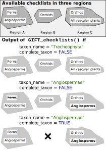

<style>
body {
text-align: justify}
</style>

```{r setup, include=FALSE}

knitr::opts_chunk$set(echo = TRUE, message = FALSE, warning = FALSE,
                      fig.width = 4, fig.height = 4, fig.align = "center")
# Packages --------------------------------------------------------------------
suppressPackageStartupMessages({
  suppressWarnings({
    library("GIFT")
    library("dplyr")
    library("knitr")
    library("kableExtra")
    library("ggplot2")
    library("sf")
    library("rnaturalearth")
    library("rnaturalearthdata")
    library("tidyr")
    library("ape")
    library("BiocManager")
    install("ggtree")
    library("ggtree")
    library("tidytree")
    install("ggtreeExtra")
    library("ggtreeExtra")
  })
})

options(tinytex.verbose = TRUE)
```

```{r gottingen_logo, fig.show = 'hold', out.width = "20%", echo = FALSE}
knitr::include_graphics("../man/figures/biodiv_gottingen_logo.png")
knitr::include_graphics("../man/figures/GIFT.png")
```

<br>

The Global Inventory of Floras and Traits (GIFT) is a database of floras and
plant checklists, distributed worldwide. It also includes trait and
phylogenetic information [@Weigelt2020]. The GIFT R package grants an access to
the GIFT database.
<br>
This vignette illustrates the most common usages of the package through
detailed examples.

1. Retrieving plant checklists within a given area (example: Mediterranean)  
2. Getting the distribution of a plant species  
3. Retrieving trait information for a subset of plant species  
4. Retrieving environmental information for a list of polygons/regions  
5. Retrieving a plant phylogeny and plotting a trait coverage on it  

<br>

The following R packages are needed to build this vignette:

```{r, echo=TRUE, eval=FALSE}
library("GIFT")
library("dplyr")
library("ggplot2")
library("sf")
library("rnaturalearth")
library("rnaturalearthdata")
library("tidyr")
library("patchwork")
```

<br><br>

# 1. Checklists for a region
## 1.1. Shapefile
Let's assume we are interested in having a floristic knowledge of the western
part of the Mediterranean basin. For this purpose, we can simply use a
shapefile of the region of interest and feed it to the `GIFT_checklist()`
function.  

We do provide a shapefile of this region in the `GIFT` R package, which you
can access using the `data("western_mediterranean")` command.

```{r, fig.width = 3, fig.height = 3}
data("western_mediterranean")

world <- ne_coastline(scale = "medium", returnclass = "sf")
world_countries <- ne_countries(scale = "medium", returnclass = "sf")
# Fixing polygons crossing dateline
world <- st_wrap_dateline(world)
world_countries <- st_wrap_dateline(world_countries)

# Eckert IV projection
eckertIV <-
  "+proj=eck4 +lon_0=0 +x_0=0 +y_0=0 +ellps=WGS84 +datum=WGS84 +units=m +no_defs"

ggplot(world) +
  geom_sf(color = "gray50") +
  geom_sf(data = western_mediterranean, fill = "darkblue", color = "black",
          alpha = 0.5, size = 1) +
  labs(title = "Western Mediterranean basin") +
  lims(x = c(-20, 20), y = c(24, 48)) +
  theme_void()
```

<br>
*Please note that shapes used in GIFT are unprojected (Geographic Coordinate *
*System WGS84), and that all shapefiles provided should be in this CRS.*
*You can check the coordinate reference system of a sf object by using*
`sf::st_crs().`
<br>

## 1.2. Main arguments

Now that we have a shape for the region of interest, let's call
`GIFT_checklist()`. This wrapper function has many arguments which we detail
in this subsection.
<br>
First, the taxonomic group of interest. We can be interested in a particular
group of plants, for example only Angiosperms. In that case, we would set the
`taxon_name` argument like this `taxon_name = "Angiospermae"`. If we are
interested in a particular plant family, let's say orchids, then 
`taxon_name = "Orchidaceae"`.
<br>
To see all options for the `taxon_name` argument, you can run the
`GIFT_taxonomy()` function and look at the `taxon_name` column of its output.
<br>
Together with this first argument comes `complete_taxon`. This argument, set by
default to TRUE defines whether only regions represented by checklists in GIFT
completely covering **the taxon of interest** should be retrieved. Figure 1 is
explaining the principle.
<br><br>

```{r, fig.cap = "Figure 1. Principle of the complete_taxon argument", out.width = "50%",echo = FALSE}

```
<br>
In Figure 1, we want to retrieve checklists of Angiosperms. In the first region
available, region A only one checklist is of interest. This checklist is then
always retrieved. In region B, there is only a checklist of orchids, which is
a subset only of Angiosperms. If `complete_taxon` is set to `TRUE`, then this
checklist won't be retrieved, otherwise yes. Finally, in region C, there is a
checklist of vascular plants and one for orchids. In both cases, the checklist
of vascular plants will be retrieved after filtering out the non-angiosperm
species. The species of Orchids is also retrieved in both cases as it is not
the only one available and as it can complete the floristic knowledge for
Angiosperms in this region.
<br>
<br>
Following arguments of `GIFT_checklist()` relate to the floristic statuses of
plant species. We can for example only be interested in endemic species, or
naturalized species. Default value is retrieving all native species.
<br>
Similarly, two arguments are needed in the function. First, `floristic_group`
defines the group of interest. Second, `complete_floristic` states whether
incomplete regions regarding the floristic group chosen should be retrieved or
not. The logic is detailed in Figure 2 and is similar to the `complete_taxon`
argument shown before.  

<br>
```{r, fig.cap = "Figure 2. Principle of the complete_floristic argument", out.width = "50%", echo = FALSE}
knitr::include_graphics("../man/figures/GIFT_complete_floristic.svg")
```
<br>

The next set of arguments relate to spatial matching between the desired area
and the GIFT database. 
<br>

The main argument in that regard, when providing a shapefile or a set of
coordinates, is the `overlap` argument. This argument can get 4 options, each
of these options leading to a different outcome as explained in Figure 3.
<br>

```{r, fig.cap = "Figure 3. Principle of GIFT_spatial()", out.width = "50%", echo = FALSE}
knitr::include_graphics("../man/figures/GIFT_spatial.svg")
```
<br>

On Figure3, the GIFT polygons represented in orange either intersect, fall
inside or outside the provided shape file. The overlap argument below each GIFT
polygon illustrates in which situation a given GIFT polygon is retrieved or
not.

<br>

Another important spatial feature we provide is the possibility to remove
overlapping polygons. Indeed, for many regions in the world, there are several
polygons in GIFT database that cover them. If overlapping polygons are not an
issue for your case study, you can simply set `remove_overlap` to FALSE (top
right part of Figure 4). 
But in case you want one polygon only per region, then `remove_overlap` can be
set to `TRUE`. In that case, the `GIFT_checklist()` will either retrieve the
smaller or the larger polygon. This will depend on the values set for the
argument `area_threshold_mainland` as detailed in Figure 4.
<br>

```{r, fig.cap = "Figure 4. Removing overlapping polygons with remove_overlap argument", out.width = "50%", echo = FALSE}
knitr::include_graphics("../man/figures/GIFT_no_overlap.svg")
```
<br>

`area_threshold_mainland` takes a value in $km^2$. In case the area of the
smaller polygon is below the threshold, then the larger overlapping polygon
will be retrieved (bottom left part in Figure 4). If the smaller polygon
exceeds that threshold, then it will be retrieved (bottom right part of
Figure 4).
There is a similar argument for islands, `area_threshold_island`, which is by
default set to 0 $km^2$. That way, by default, the smaller islands are always
retrieved.
<br><br>
Please also note that polygons are considered as overlapping when the exceed a
certain percentage of overlap. This percentage can be modified using the
`overlap_threshold` argument (Figure 5). This argument is set by default to
10%.
<br>

```{r, fig.cap = "Figure 5. Principle of the overlap_th argument", out.width = "50%", echo = FALSE}
knitr::include_graphics("../man/figures/GIFT_overlap_th.svg")
```
<br>

## 1.3. GIFT_checklist()

Now that we covered the main arguments of `GIFT_checklist()`, we can retrieve
plant checklists for the Mediterranean region. `GIFT_checklist()` returns a
list of two elements. First the metadata of checklists fulfilling the
different criteria, named `$lists`. The second element is a `data.frame` of all
the checklists with the species composition per checklist (`$checklists`).
<br>
If you only want to retrieve the metadata, you can set the argument
`list_set_only` to `TRUE`.
<br>

```{r, eval=FALSE}
ex_meta <- GIFT_checklist(taxon_name = "Angiospermae",
                          shp = western_mediterranean,
                          overlap = "centroid_inside",
                          list_set_only = TRUE)
```

<br>
And to retrieve the species composition:
<br>

```{r, include = FALSE}
medit <- GIFT_checklist(taxon_name = "Angiospermae",
                        complete_taxon = TRUE,
                        floristic_group = "native",
                        complete_floristic = TRUE,
                        geo_type = "All",
                        shp = western_mediterranean,
                        overlap = "centroid_inside", 
                        remove_overlap = FALSE,
                        taxonomic_group = TRUE)
```

```{r, eval = FALSE, echo = TRUE}
medit <- GIFT_checklist(taxon_name = "Angiospermae",
                        complete_taxon = TRUE,
                        floristic_group = "native",
                        complete_floristic = TRUE,
                        geo_type = "All",
                        shp = western_mediterranean,
                        overlap = "centroid_inside", 
                        remove_overlap = FALSE,
                        taxonomic_group = TRUE) # this argument adds two
# columns to the checklist: plant family and taxonomic group of each species
```

<br>

We can now have an estimation on the number of checklists with native
Angiosperm species in the western part of the Mediterranean basin, as well as
of the number of species.
<br>

```{r, eval=TRUE}
# Number of references covered
length(unique(medit[[2]]$ref_ID))
# Number of checklists covered (one reference can have several lists inside)
length(unique(medit[[2]]$list_ID))
# Number of species
length(unique(medit[[2]]$work_species))
```

<br>
You can now apply different values for the arguments detailed above. When being
stricter with some criteria, you can see that the number of checklists
retrieved decreases. For example, when removing overlapping regions:
<br>

```{r, include = FALSE}
medit_no_overlap <- GIFT_checklist(shp = western_mediterranean,
                                   overlap = "centroid_inside",
                                   taxon_name = "Angiospermae",
                                   remove_overlap = TRUE)
```

```{r, eval = FALSE, echo = TRUE}
medit_no_overlap <- GIFT_checklist(shp = western_mediterranean,
                                   overlap = "centroid_inside",
                                   taxon_name = "Angiospermae",
                                   remove_overlap = TRUE)
```

```{r}
# Number of references covered
length(unique(medit[[2]]$ref_ID))
length(unique(medit_no_overlap[[2]]$ref_ID))
```

Please note that the function not only works with a shape file but can accept a
set of coordinates. The example below illustrates a case in which you want to
retrieve GIFT checklists intersecting the coordinates of Göttingen.
<br>

```{r}
custom_point <- cbind(9.9, 51) # coordinates of Göttingen

got <- GIFT_checklist(coordinates = custom_point,
                      overlap = "extent_intersect",
                      taxon_name = "Angiospermae",
                      remove_overlap = TRUE,
                      list_set_only = TRUE)

kable(got[[1]], "html") %>%
  kable_styling(full_width = FALSE)
```
<br><br>

To cite properly the references retrieved, you can run the function
`GIFT_references()` and look for the column `ref_long``. The column also
`geo_entity_ref` associates each reference to a name.

<br>

## 1.4. Species richness map

Once we downloaded a set of checklists, it is possible to map the species
richness of the taxonomic group of interest. For this purpose, we use a
combination of two functions: `GIFT_richness()` which either retrieves species
richness or trait coverage per polygon and `GIFT_shapes()` which retrieves the
shapefile of a list of GIFT polygons.
<br>
The next two chunks illustrate this for the Angiosperms in the World and in the
Western part of the Mediterranean basin.
<br>

```{r, include=FALSE}
gift_shapes <- GIFT_shapes() # retrieves all shapefiles by default
```

```{r, eval=FALSE, echo = TRUE}
gift_shapes <- GIFT_shapes() # retrieves all shapefiles by default
```

```{r, message=FALSE, fig.width = 8, fig.height = 4}
angio_rich <- GIFT_richness(taxon_name = "Angiospermae")

rich_map <- dplyr::left_join(gift_shapes, angio_rich, by = "entity_ID") %>%
  dplyr::filter(stats::complete.cases(total))

ggplot(world) +
  geom_sf(color = "gray50") +
  geom_sf(data = rich_map, aes(fill = total + 1)) +
  scale_fill_viridis_c("Species number\n(log-transformed)", trans = "log10",
                       labels = scales::number_format(accuracy = 1)) +
  labs(title = "Angiosperms", subtitle = "Projection EckertIV") +
  coord_sf(crs = eckertIV) +
  theme_void()
```

<br>
By customizing the code above, you can also produce a nicer map:

```{r, echo = FALSE, message = FALSE, fig.width = 8, fig.height = 4}
# Background box
xmin <- st_bbox(world)[["xmin"]]; xmax <- st_bbox(world)[["xmax"]]
ymin <- st_bbox(world)[["ymin"]]; ymax <- st_bbox(world)[["ymax"]]
bb <- sf::st_union(sf::st_make_grid(st_bbox(c(xmin = xmin,
                                              xmax = xmax,
                                              ymax = ymax,
                                              ymin = ymin),
                                            crs = st_crs(4326)),
                                    n = 100))

# Equator line
equator <- st_linestring(matrix(c(-180, 0, 180, 0), ncol = 2, byrow = TRUE))
equator <- st_sfc(equator, crs = st_crs(world))

ggplot(world) +
  geom_sf(data = bb, fill = "aliceblue") +
  geom_sf(data = equator, color = "gray50", linetype = "dashed",
          linewidth = 0.1) +
  geom_sf(data = world_countries, fill = "antiquewhite1", color = NA) +
  geom_sf(color = "gray50", linewidth = 0.1) +
  geom_sf(data = bb, fill = NA) +
  geom_sf(data = rich_map,
          aes(fill = ifelse(rich_map$entity_class %in%
                              c("Island/Mainland", "Mainland",
                                "Island Group", "Island Part"),
                            total + 1, NA)),
          size = 0.1) +
  geom_point(data = rich_map,
             aes(color = ifelse(rich_map$entity_class %in%
                                  c("Island"),
                                total + 1, NA),
                 geometry = geometry),
             stat = "sf_coordinates", size = 1, stroke = 0.5) +
  scale_color_gradientn(
    "Species number", trans = "log10", limits = c(1, 40000), 
    colours = RColorBrewer::brewer.pal(5, name = "Greens"),
    breaks = c(1, 10, 100, 1000, 10000, 40000),
    labels = c(1, 10, 100, 1000, 10000, 40000),
    na.value = "transparent") +
  scale_fill_gradientn(
    "Species number", trans = "log10", limits = c(1, 40000), 
    colours = RColorBrewer::brewer.pal(5, name = "Greens"),
    breaks = c(1, 10, 100, 1000, 10000, 40000),
    labels = c(1, 10, 100, 1000, 10000, 40000),
    na.value = "transparent") +
  labs(title = "Angiosperms", subtitle = "Projection EckertIV") +
  coord_sf(crs = eckertIV) +
  theme_void()
```

<br>
Below is the `R` code to produce the above map if interested.
<br>

<details><summary>Fancier code</summary>
```{r, eval=FALSE}
ggplot(world) +
  geom_sf(data = bb, fill = "aliceblue") +
  geom_sf(data = equator, color = "gray50", linetype = "dashed",
          linewidth = 0.1) +
  geom_sf(data = world_countries, fill = "antiquewhite1", color = NA) +
  geom_sf(color = "gray50", linewidth = 0.1) +
  geom_sf(data = bb, fill = NA) +
  geom_sf(data = rich_map,
          aes(fill = ifelse(rich_map$entity_class %in%
                              c("Island/Mainland", "Mainland",
                                "Island Group", "Island Part"),
                            total + 1, NA)),
          size = 0.1) +
  geom_point(data = rich_map,
             aes(color = ifelse(rich_map$entity_class %in%
                                  c("Island"),
                                total + 1, NA),
                 geometry = geometry),
             stat = "sf_coordinates", size = 1, stroke = 0.5) +
  scale_color_gradientn(
    "Species number", trans = "log10", limits = c(1, 40000), 
    colours = RColorBrewer::brewer.pal(5, name = "Greens"),
    breaks = c(1, 10, 100, 1000, 10000, 40000),
    labels = c(1, 10, 100, 1000, 10000, 40000),
    na.value = "transparent") +
  scale_fill_gradientn(
    "Species number", trans = "log10", limits = c(1, 40000), 
    colours = RColorBrewer::brewer.pal(5, name = "Greens"),
    breaks = c(1, 10, 100, 1000, 10000, 40000),
    labels = c(1, 10, 100, 1000, 10000, 40000),
    na.value = "transparent") +
  labs(title = "Angiosperms", subtitle = "Projection EckertIV") +
  coord_sf(crs = eckertIV) +
  theme_void()
```
</details>
<br><br>

We can also produce maps of richness at intermediate scales. Here is the code
and the map of Angiosperms in the Western Mediterranean basin.  
<br>

```{r, message=FALSE, fig.width = 8, fig.height = 4}
med_shape <- gift_shapes[which(gift_shapes$entity_ID %in% 
                                 unique(medit[[2]]$entity_ID)), ]

med_rich <- angio_rich[which(angio_rich$entity_ID %in% 
                               unique(medit[[2]]$entity_ID)), ]

med_map <- dplyr::left_join(med_shape, med_rich, by = "entity_ID") %>%
  dplyr::filter(stats::complete.cases(total))

ggplot(world) +
  geom_sf(color = "gray50") +
  geom_sf(data = western_mediterranean,
          fill = "darkblue", color = "black", alpha = 0.1, size = 1) +
  geom_sf(data = med_map, aes(fill = total)) +
  scale_fill_viridis_c("Species number") +
  labs(title = "Angiosperms in the Western Mediterranean basin") +
  lims(x = c(-20, 20), y = c(24, 48)) +
  theme_void()
```

<br><br>

# 2. Distribution of species

The GIFT R package also allows for retrieving the spatial distribution of a
focal plant species.
<br>

## 2.1. Available species
To know what plant species are available, you can first run the function
`GIFT_species()`.

```{r}
all_sp <- GIFT_species()
```

`r length(unique(all_sp$work_ID))` species are currently available in the
database. This number may increase with new releases of the database.

## 2.2. Species names and taxonomic harmonization

Since GIFT is a collection of checklists in which authors use their own
taxonomic knowledge to describe species, there is a step of taxonomic
harmonization when including checklists into the database. The most frequent
backbone used is the
[World Checklists of Vascular Plants (WCVP)](https://wcvp.science.kew.org/).
<br>
Both original and harmonized names are stored in the database and you can use
the function `GIFT_species_lookup()` to look at the differences for particular
species. For example, the wood anemone *Anemone nemorosa*.
<br>

```{r anemone_lookup}
anemone_lookup <- GIFT_species_lookup(genus = "Anemone", epithet = "nemorosa")

kable(anemone_lookup, "html") %>%
  kable_styling(full_width = FALSE)
```

Looking at the output table, you can see the original species names and their
identification numbers (`name_ID`) **before** taxonomic harmonization. The
species' names and IDs **after** taxonmic harmonization are the last columns on
the right starting with the prefix `work_`.

<br><br>

## 2.3. Species distribution
<br>
Now that we have a focal species and its harmonized name, we can retrieve its
distribution using `GIFT_species_distribution()`.
<br>
Please note that we here set the `aggregation` argument to `TRUE` in order to
have only one floristic status per polygon. For further details, check the
help page of the function.
<br>

```{r}
anemone_distr <- GIFT_species_distribution(
  genus = "Anemone", epithet = "nemorosa", aggregation = TRUE)

anemone_statuses <- anemone_distr %>%
  mutate(native = ifelse(native == 1, "native", "non-native"),
         naturalized = ifelse(naturalized == 1, "naturalized",
                              "non-naturalized"),
         endemic_list = ifelse(endemic_list == 1, "endemic_list",
                               "non-endemic_list")) %>%
  dplyr::select(entity_ID, native, naturalized, endemic_list)

table(anemone_statuses$endemic_list)
```

This species is not listed as endemic in any of the GIFT polygons. Let's now
check the places where it is listed as native or naturalized.
<br>

```{r}
table(paste(anemone_statuses$native, anemone_statuses$naturalized,
            sep = "_"))
```

Looking at the different combinations of statuses, we can distinguish several
situations: in 13 polygons, there is no status available. The species is listed
as native and non-naturalized (or naturalized status is missing) in 113+17=130
polygons. It is naturalized and non native in 5 polygons.
<br>
More surprising are the cases where the species is non-native and
non-naturalized, which happens in 3+2=5 polygons. This specific combination
can happen in unstable cases where the species in the process of being
naturalized.
<br>

Now that we know in which polygons the species occur and with what status, we
can map its distribution using the GIFT shapes we retrieved earlier using
`GIFT_shapes()`.

```{r, fig.width = 8, fig.height = 4}
# We rename the statuses based on the distinct combinations
anemone_statuses <- anemone_statuses %>%
  mutate(Status = case_when(
    native == "native" & naturalized == "non-naturalized" ~ "native",
    native == "native" & is.na(naturalized) ~ "native",
    native == "non-native" & is.na(naturalized) ~ "non-native",
    native == "non-native" & naturalized == "naturalized" ~ "naturalized",
    native == "non-native" & naturalized == "non-naturalized" ~ "non-native",
    is.na(native) & is.na(naturalized) ~ "unknown"
  ))

# Merge with the shapes
anemone_shape <- gift_shapes[which(gift_shapes$entity_ID %in% 
                                     unique(anemone_distr$entity_ID)), ]
anemone_map <- dplyr::left_join(anemone_shape, anemone_statuses,
                                by = "entity_ID")

# Area of distribution with floristic status
ggplot(world) +
  geom_sf(color = "gray70") +
  geom_sf(data = anemone_map, color = "black", aes(fill = as.factor(Status))) +
  scale_fill_brewer("Status", palette = "Set2") +
  labs(title = expression(paste("Distribution map of ",
                                italic("Anemone nemorosa"))),
       subtitle = "Unprojected (GCS: WGS84)") +
  lims(x = c(-65, 170), y = c(-45, 70)) +
  theme_void()
```

<br>
By customizing the code above, you can also produce a nicer map:

```{r, echo = FALSE, message = FALSE, fig.width = 8, fig.height = 4}
anemone_map_plot_bg_parts <-
  ggplot(world) +
  geom_sf(data = bb, fill = "aliceblue", color = NA) +
  geom_sf(data = equator, color = "gray50", linetype = "dashed",
          linewidth = 0.1) +
  geom_sf(data = world_countries, fill = "antiquewhite1", color = NA) +
  geom_sf(color = "gray50", linewidth = 0.1) +
  geom_sf(data = bb, fill = NA) +
  geom_sf(data = anemone_map, color = "black", aes(fill = as.factor(Status))) +
  scale_fill_manual("Status",
                    values = c("native" = "#2c7bb6",
                               "naturalized" = "#d7191c",
                               "non-native" = "#fdae61",
                               "unknown" = "#abd9e9")) +
  labs(title = expression(paste("b) Distribution map of ",
                                italic("Anemone nemorosa")))) +
  theme_void() +
  theme(axis.title = element_blank(),
        axis.text = element_blank(),
        axis.ticks = element_blank())

(anemone_map_plot_bg_parts +
    lims(x = c(-69, 61), y = c(37, 70)) + # Europe & Newfoundland
    theme(panel.border = element_rect(fill = NA, linewidth = 1)) +
    theme(legend.position = "bottom")) +
  (anemone_map_plot_bg_parts +
     lims(x = c(165, 178), y = c(-47, -35)) + # new zealand
     labs(title = "") +
     guides(fill = "none") +
     theme(panel.border = element_rect(fill = NA, linewidth = 1))) +
  patchwork::plot_layout()
```

<br>
Below is the `R` code to produce the above map if interested.
<br>

<details><summary>Fancier code</summary>
```{r, eval=FALSE}
anemone_map_plot_bg_parts <-
  ggplot(world) +
  geom_sf(data = bb, fill = "aliceblue", color = NA) +
  geom_sf(data = equator, color = "gray50", linetype = "dashed",
          linewidth = 0.1) +
  geom_sf(data = world_countries, fill = "antiquewhite1", color = NA) +
  geom_sf(color = "gray50", linewidth = 0.1) +
  geom_sf(data = bb, fill = NA) +
  geom_sf(data = anemone_map, color = "black", aes(fill = as.factor(Status))) +
  scale_fill_manual("Status",
                    values = c("native" = "#2c7bb6",
                               "naturalized" = "#d7191c",
                               "non-native" = "#fdae61",
                               "unknown" = "#abd9e9")) +
  labs(title = expression(paste("b) Distribution map of ",
                                italic("Anemone nemorosa")))) +
  theme_void() +
  theme(axis.title = element_blank(),
        axis.text = element_blank(),
        axis.ticks = element_blank())

(anemone_map_plot_bg_parts +
    lims(x = c(-69, 61), y = c(37, 70)) + # Europe & Newfoundland
    theme(panel.border = element_rect(fill = NA, linewidth = 1)) +
    theme(legend.position = "bottom")
  |
    anemone_map_plot_bg_parts +
    lims(x = c(165, 178), y = c(-47, -35)) + # new zealand
    labs(title = "") +
    guides(fill = "none") +
    theme(panel.border = element_rect(fill = NA, linewidth = 1)))
```
</details>
<br>

<br><br>

# 3. Trait data

Trait information at the species or at a higher taxonomic level are also made
available in the `GIFT` R package.
<br>

## 3.1. Metadata
<br>
There are many functional traits available in GIFT. Each of these traits has
an identification number called `trait_ID`. As the two functions retrieving
trait values, `GIFT_traits()` and `GIFT_traits_raw()`, rely on these IDs, the
first step to do is to run the function `GIFT_traits_meta()` to know what is
the ID of the wanted trait.
<br>
For example, let's say we want to retrieve the maximal vegetative heights of
plant species.
<br>
```{r}
trait_meta <- GIFT_traits_meta()
trait_meta[which(trait_meta$Trait2 == "Plant_height_max"), ]
```
<br>
We can see that the ID of this trait is `1.6.2`. Now that we have the ID, we
can retrieve the growth form values of different plant species using
`GIFT_traits()`.

<br>

## 3.2. Trait values
### 3.2.1. Species level
There are two functions to access trait values. First, `GIFT_traits_raw()`
gives all the trait values for a given species and a given trait. These trait
values can then vary.
<br>
Second, `GIFT_traits()` returns an aggregated trait value at the species level.
The aggregation simply takes the mean for continuous traits or the most
frequent entry for categorical traits. However, for some specific cases, the
aggregation takes either the minimum or maximum, like for the trait we chose.
<br>
Let's retrieve the raw and aggregated values for the maximal vegetative height
of plants (trait_ID 1.6.2).
<br>

```{r, include=FALSE}
height <- GIFT_traits(trait_IDs = c("1.6.2"), agreement = 0.66,
                      bias_ref = FALSE, bias_deriv = FALSE)

height_raw <- GIFT_traits_raw(trait_IDs = c("1.6.2"))
```

```{r, echo = TRUE, eval = FALSE}
height <- GIFT_traits(trait_IDs = c("1.6.2"), agreement = 0.66,
                      bias_ref = FALSE, bias_deriv = FALSE)

height_raw <- GIFT_traits_raw(trait_IDs = c("1.6.2"))
```

```{r, message=FALSE}
# Raw values
as.numeric(height_raw[which(height_raw$work_species == "Fagus sylvatica"),
                      "trait_value"])
```

Three maximal heights for *Fagus sylvatica* were available, 30, 35 and 50
meters, which led to an aggregated value of 50 meters.  
<br>
And if you want to look up the references that led to the aggregated trait
value, you can run this chunk:  

```{r, message=FALSE}
# Aggregated value
as.numeric(height[which(height$work_species == "Fagus sylvatica"),
                  "trait_value_1.6.2"])

references <- GIFT_references(GIFT_version = "beta")

unique(unlist(strsplit(height$references_1.6.2, ",")))

references <- references[
  which(references$ref_ID %in% 
          unique(unlist(strsplit(height$references_1.6.2, ",")))), ]
references[1:2, ]
```

<br>

### 3.2.2. Taxonomic level

Traits can also be retrieved at a higher taxonomic level, using
`GIFT_traits_tax()`.
<br>
As an example, we here attempt to retrieve three traits at the family level.
The three traits asked are woodiness (`trait_ID = "1.1.1"`),
growth form (`trait_ID = "1.2.1"`) and whether the plant is a climber
(`trait_ID = "1.4.1"`).

```{r, include=FALSE}
trait_tax <- GIFT_traits_tax(trait_IDs = c("1.1.1", "1.2.1", "1.4.1"),
                             bias_ref = FALSE, bias_deriv = FALSE)
```

```{r, echo=TRUE, eval=FALSE}
trait_tax <- GIFT_traits_tax(trait_IDs = c("1.1.1", "1.2.1", "1.4.1"),
                             bias_ref = FALSE, bias_deriv = FALSE)
```

Among the three traits asked, the growth form was not available at the family
level. The output table therefore contains trait values for the two other
traits at the family level.

```{r}
trait_tax[1:3, ]
```

<br>

## 3.3. Trait coverage

We can also retrieve trait coverage information for polygons, using the same
function as for species richness `GIFT_coverage()`.
<br>
In combination with the shapes loaded previously, we can also map the trait
coverage.
<br>

```{r, fig.width = 8, fig.height = 4}
angio_height <- GIFT_coverage(what = "trait_coverage",
                              taxon_name = "Angiospermae",
                              trait_ID = "1.6.2")

angio_height_shape <- gift_shapes[which(gift_shapes$entity_ID %in% 
                                          unique(angio_height$entity_ID)), ]

angio_height_map <- dplyr::left_join(
  angio_height_shape, angio_height, by = "entity_ID")

angio_height_map <- angio_height_map[complete.cases(angio_height_map$native), ]

ggplot(world) +
  geom_sf(color = "gray50") +
  geom_sf(data = angio_height_map[complete.cases(angio_height_map$native), ],
          aes(fill = native)) +
  scale_fill_viridis_c("Coverage (%)") +
  labs(title = "Coverage for maximal vegetative height of Angiosperms",
       subtitle = "Projection EckertIV") +
  theme_void()
```

<br>
By customizing the code above, you can also produce a nicer map:

```{r, echo = FALSE, message = FALSE, fig.width = 8, fig.height = 4}
ggplot(world) +
  geom_sf(data = bb, fill = "aliceblue") +
  geom_sf(data = equator, color = "gray50", linetype = "dashed",
          linewidth = 0.1) +
  geom_sf(data = world_countries, fill = "antiquewhite1", color = NA) +
  geom_sf(color = "gray50", linewidth = 0.1) +
  geom_sf(data = bb, fill = NA) +
  geom_sf(data = angio_height_map,
          aes(fill = ifelse(angio_height_map$entity_class %in%
                              c("Island/Mainland", "Mainland",
                                "Island Group", "Island Part"),
                            100*native, NA)), size = 0.1) +
  geom_point(data = angio_height_map,
             aes(color = ifelse(angio_height_map$entity_class %in%
                                  c("Island"),
                                100*native, NA),
                 geometry = geometry),
             stat = "sf_coordinates", size = 1, stroke = 0.5) +
  scale_color_gradientn(
    "Coverage (%)", 
    colours = rev(RColorBrewer::brewer.pal(9, name = "PuBuGn")),
    limits = c(0, 100),
    na.value = "transparent") +
  scale_fill_gradientn(
    "Coverage (%)", 
    colours = rev(RColorBrewer::brewer.pal(9, name = "PuBuGn")),
    limits = c(0, 100),
    na.value = "transparent") +
  labs(title = "Coverage for maximal vegetative height of Angiosperms",
       subtitle = "Projection EckertIV") +
  coord_sf(crs = eckertIV) +
  theme_void()
```

<br>
Below is the `R` code to produce the above map if interested.
<br>

<details><summary>Fancier code</summary>
```{r, eval=FALSE}
ggplot(world) +
  geom_sf(data = bb, fill = "aliceblue") +
  geom_sf(data = equator, color = "gray50", linetype = "dashed",
          linewidth = 0.1) +
  geom_sf(data = world_countries, fill = "antiquewhite1", color = NA) +
  geom_sf(color = "gray50", linewidth = 0.1) +
  geom_sf(data = bb, fill = NA) +
  geom_sf(data = angio_height_map,
          aes(fill = ifelse(angio_height_map$entity_class %in%
                              c("Island/Mainland", "Mainland",
                                "Island Group", "Island Part"),
                            100*native, NA)), size = 0.1) +
  geom_point(data = angio_height_map,
             aes(color = ifelse(angio_height_map$entity_class %in%
                                  c("Island"),
                                100*native, NA),
                 geometry = geometry),
             stat = "sf_coordinates", size = 1, stroke = 0.5) +
  scale_color_gradientn(
    "Coverage (%)", 
    colours = rev(RColorBrewer::brewer.pal(9, name = "PuBuGn")),
    limits = c(0, 100),
    na.value = "transparent") +
  scale_fill_gradientn(
    "Coverage (%)", 
    colours = rev(RColorBrewer::brewer.pal(9, name = "PuBuGn")),
    limits = c(0, 100),
    na.value = "transparent") +
  labs(title = "Coverage for maximal vegetative height of Angiosperms",
       subtitle = "Projection EckertIV") +
  coord_sf(crs = eckertIV) +
  theme_void()
```
</details>
<br>

<br><br>

# 4. Environmental variables

Finally, a set of summary statistics for many environmental variables can be
retrieved for each GIFT polygon.

## 4.1. Metadata
We here illustrate how to retrieve environmental variables, summarized at the
polygon level, for a subset of polygons.
<br>
We here retrieve environmental variables for the polygons falling into the
western Mediterranean basin, retrieved in the section 1.
<br>
To know what variables are available, you can run these two metadata functions: `GIFT_env_meta_misc()` and `GIFT_env_meta_raster()`. They respectively give
access to the list of miscellaneous variables and raster layers available in
the GIFT database.
<br>
The references to cite when using environmental variables are also available
through these functions (column `ref_long` of the outputs).  
<br>
```{r env_meta}
misc_env <- GIFT_env_meta_misc()
raster_env <- GIFT_env_meta_raster()
```
<br>

## 4.2. Environmental values
Now, let's say we want to retrieve the perimeter and biome of each polygon as
well as elevation and mean temperature. For these two raster layers, we need to
define summary statistics, as the polygons are usually bigger than the raster
resolution.
<br>
They are many summary statistics available, you can check the help page of
`GIFT_env()` to see them all. Let's here call for the mean and median of
elevation and the maximal value of average temperature.
<br>
```{r}
med_env <- GIFT_env(entity_ID = unique(medit[[2]]$entity_ID),
                    miscellaneous = c("perimeter", "biome"),
                    rasterlayer = c("mn30_grd", "wc2.0_bio_30s_01"),
                    sumstat = list(c("mean", "med"), "max"))

med_env[1, ]
```

<br>

## 4.3. Map

Using the shapes previously loaded, we can also map a particular environmental
variable for all GIFT polygons.

```{r, fig.width = 8, fig.height = 4}
world_temp <- GIFT_env(entity_ID = unique(angio_rich$entity_ID),
                       rasterlayer = c("wc2.0_bio_30s_01"),
                       sumstat = c("mean"))

temp_shape <- gift_shapes[which(gift_shapes$entity_ID %in% 
                                  unique(angio_rich$entity_ID)), ]

temp_map <- dplyr::left_join(temp_shape, world_temp, by = "entity_ID")

ggplot(world) +
  geom_sf(color = "gray50") +
  geom_sf(data = temp_map, aes(fill = mean_wc2.0_bio_30s_01)) +
  scale_fill_viridis_c("Celsius degrees") +
  labs(title = "Average temperature",
       subtitle = "Projection EckertIV") +
  coord_sf(crs = eckertIV) +
  theme_void()
```

<br>
By customizing the code above, you can also produce a nicer map:

```{r, echo = FALSE, message = FALSE, fig.width = 8, fig.height = 4}
ggplot(world) +
  geom_sf(data = bb, fill = "aliceblue") +
  geom_sf(data = equator, color = "gray50", linetype = "dashed",
          linewidth = 0.1) +
  geom_sf(data = world_countries, fill = "antiquewhite1", color = NA) +
  geom_sf(color = "gray50", linewidth = 0.1) +
  geom_sf(data = bb, fill = NA) +
  geom_sf(data = temp_map,
          aes(fill = ifelse(temp_map$entity_class %in%
                              c("Island/Mainland", "Mainland",
                                "Island Group", "Island Part"),
                            mean_wc2.0_bio_30s_01, NA)), size = 0.1) +
  geom_point(data = temp_map,
             aes(color = ifelse(temp_map$entity_class %in%
                                  c("Island"),
                                mean_wc2.0_bio_30s_01, NA),
                 geometry = geometry),
             stat = "sf_coordinates", size = 1, stroke = 0.5) +
  scale_color_gradientn(
    "°C", 
    colours = RColorBrewer::brewer.pal(9, name = "Reds"),
    limits = c(-20, 30),
    na.value = "transparent") +
  scale_fill_gradientn(
    "°C", 
    colours = RColorBrewer::brewer.pal(9, name = "Reds"),
    limits = c(-20, 30),
    na.value = "transparent") +
  labs(title = "Average temperature",
       subtitle = "Projection EckertIV") +
  coord_sf(crs = eckertIV) +
  theme_void()
```

<br>
Below is the `R` code to produce the above map if interested.
<br>

<details><summary>Fancier code</summary>
```{r, eval=FALSE}
ggplot(world) +
  geom_sf(data = bb, fill = "aliceblue") +
  geom_sf(data = equator, color = "gray50", linetype = "dashed",
          linewidth = 0.1) +
  geom_sf(data = world_countries, fill = "antiquewhite1", color = NA) +
  geom_sf(color = "gray50", linewidth = 0.1) +
  geom_sf(data = bb, fill = NA) +
  geom_sf(data = temp_map,
          aes(fill = ifelse(temp_map$entity_class %in%
                              c("Island/Mainland", "Mainland",
                                "Island Group", "Island Part"),
                            mean_wc2.0_bio_30s_01, NA)), size = 0.1) +
  geom_point(data = temp_map,
             aes(color = ifelse(temp_map$entity_class %in%
                                  c("Island"),
                                mean_wc2.0_bio_30s_01, NA),
                 geometry = geometry),
             stat = "sf_coordinates", size = 1, stroke = 0.5) +
  scale_color_gradientn(
    "°C", 
    colours = RColorBrewer::brewer.pal(9, name = "Reds"),
    limits = c(-20, 30),
    na.value = "transparent") +
  scale_fill_gradientn(
    "°C", 
    colours = RColorBrewer::brewer.pal(9, name = "Reds"),
    limits = c(-20, 30),
    na.value = "transparent") +
  labs(title = "Average temperature",
       subtitle = "Projection EckertIV") +
  coord_sf(crs = eckertIV) +
  theme_void()
```
</details>
<br>

<br><br>

# 5. Phylogeny

Phylogeny from [Jin & Qian (2022)](https://doi.org/10.1016/j.pld.2022.12.007)
Matched to the taxonomy of GIFT.

```{r include=FALSE}
# Retrieving phylogeny, taxonomy and species from GIFT
phy <- GIFT_phylogeny(clade = "Tracheophyta", GIFT_version = "beta")
tax <- GIFT_taxonomy(GIFT_version = "beta")
gift_sp <- GIFT_species(GIFT_version = "beta")

gf <- GIFT_traits(trait_IDs = "1.2.1", agreement = 0.66, bias_ref = FALSE,
                  bias_deriv = FALSE, GIFT_version = "beta")
```

```{r, eval=FALSE, echo=TRUE}
# Retrieving phylogeny, taxonomy and species from GIFT
phy <- GIFT_phylogeny(clade = "Tracheophyta", GIFT_version = "beta")
tax <- GIFT_taxonomy(GIFT_version = "beta")
gift_sp <- GIFT_species(GIFT_version = "beta")

gf <- GIFT_traits(trait_IDs = "1.2.1", agreement = 0.66, bias_ref = FALSE,
                  bias_deriv = FALSE, GIFT_version = "beta")
```

```{r}
# Replacing space with _ for the species names
gf$work_species <- gsub(" ", "_", gf$work_species, fixed = TRUE)
```


```{r}
# Retrieving family of each species
sp_fam <- GIFT_taxgroup(work_ID = unique(gift_sp$work_ID),
                        taxon_lvl = "family", GIFT_version = "beta")
sp_genus_fam <- data.frame(
  work_ID = unique(gift_sp$work_ID),
  work_species = unique(gift_sp$work_species),
  family = sp_fam)
sp_genus_fam <- left_join(sp_genus_fam,
                          gift_sp[, c("work_ID", "work_genus")],
                          by = "work_ID")
colnames(sp_genus_fam)[colnames(sp_genus_fam) == "work_genus"] <- "genus"

# Problem with hybrid species on the tip labels of the phylo tree
phy$tip.label[substring(phy$tip.label, 1, 2) == "x_"] <-
  substring(phy$tip.label[substring(phy$tip.label, 1, 2) == "x_"],
            3,
            nchar(phy$tip.label[substring(phy$tip.label, 1, 2) == "×_"]))

phy$tip.label[substring(phy$tip.label, 1, 2) == "×_"] <-
  substring(phy$tip.label[substring(phy$tip.label, 1, 2) == "×_"],
            3,
            nchar(phy$tip.label[substring(phy$tip.label, 1, 2) == "×_"]))
```

In the next chunk, we calculate the trait coverage (for growth form) at the
genus and family level.

```{r}
sp_genus_fam <- left_join(sp_genus_fam,
                          gf[, c("work_ID", "trait_value_1.2.1")],
                          by = "work_ID")

genus_gf <- sp_genus_fam %>%
  group_by(genus) %>%
  mutate(prop_gf = round(100*sum(is.na(trait_value_1.2.1))/n(), 2)) %>%
  ungroup() %>%
  dplyr::select(-work_ID, -work_species, -family, -trait_value_1.2.1) %>%
  distinct(.keep_all = TRUE)

fam_gf <- sp_genus_fam %>%
  group_by(family) %>%
  mutate(prop_gf = round(100*sum(is.na(trait_value_1.2.1))/n(), 2)) %>%
  ungroup() %>%
  dplyr::select(-work_ID, -work_species, -genus, -trait_value_1.2.1) %>%
  distinct(.keep_all = TRUE)

sp_genus_fam$species <- gsub("([[:punct:]])|\\s+", "_",
                             sp_genus_fam$work_species)

# Keeping one species per genus only
one_sp_per_gen <- data.frame()
for(i in 1:n_distinct(sp_genus_fam$genus)){ # loop over genera
  # Focal genus
  focal_gen <- unique(sp_genus_fam$genus)[i]
  # All species in that genus
  gen_sp_i <- sp_genus_fam[which(sp_genus_fam$genus == focal_gen),
                           "species"]
  # Species from the genus available in the phylogeny
  gen_sp_i <- gen_sp_i[gen_sp_i %in% phy$tip.label]
  # Taking the first one (if at least one is available)
  gen_sp_i <- gen_sp_i[1]
  
  one_sp_per_gen <- rbind(one_sp_per_gen,
                          data.frame(species = gen_sp_i,
                                     genus = focal_gen))
}

# Adding the trait coverage per genus
one_sp_per_gen <- left_join(one_sp_per_gen, genus_gf, by = "genus")

# Adding the trait coverage per family
one_sp_per_gen <- left_join(one_sp_per_gen,
                            sp_genus_fam[!duplicated(sp_genus_fam$genus),
                                         c("genus", "family")],
                            by = "genus")
colnames(one_sp_per_gen)[colnames(one_sp_per_gen) == "prop_gf"] <-
  "prop_gf_gen"
one_sp_per_gen <- left_join(one_sp_per_gen, fam_gf, by = "family")
colnames(one_sp_per_gen)[colnames(one_sp_per_gen) == "prop_gf"] <-
  "prop_gf_fam"
```

Pruning the tree at the genus level.

```{r}
phy_gen <- ape::keep.tip(
  phy = phy,
  tip = one_sp_per_gen[complete.cases(one_sp_per_gen$species), "species"])
```

In the following plot, there is only one tip per genus. The two outer rings
illustrate the coverage of growth form per genus and per family (outer ring).
For the family ring, the width of each family is set by the number of genera
they contain.

```{r, fig.width = 6, fig.height = 6}
ggtree(phy_gen, color = "grey70", layout = "circular") %<+% one_sp_per_gen +
  geom_fruit(geom = geom_tile,
             mapping = aes(fill = prop_gf_gen),
             width = 50,
             offset = 0.1) +
  geom_fruit(geom = geom_tile,
             mapping = aes(color = prop_gf_fam, fill = prop_gf_fam),
             width = 50,
             offset = 0.1,
             show.legend = FALSE) +
  scale_color_viridis_c() +
  scale_fill_viridis_c("Growth form availability per genus (%)") +
  theme(legend.position = "bottom")
```

<br><br>

# 6. References

When using the GIFT database and the GIFT R package, here are the two
resources to cite:

[Weigelt, P., König, C., & Kreft, H. (2020). GIFT – A Global Inventory of Floras and Traits for macroecology and biogeography. Journal of Biogeography, 47(1), 16–43.](https://doi.org/10.1111/jbi.13623)

[GIFT R package](https://biogeomacro.github.io/GIFT/)
