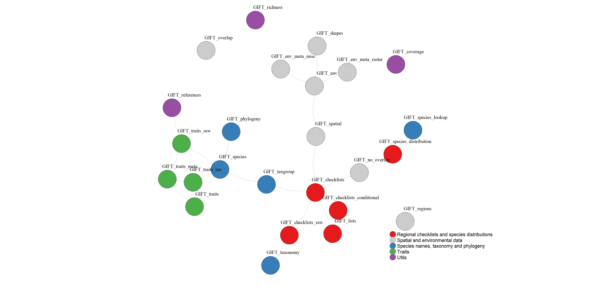

<style>
body {
text-align: justify}
</style>

```{r setup, include=FALSE}

knitr::opts_chunk$set(echo = TRUE, message = FALSE, warning = FALSE,
                      fig.width = 8, fig.height = 8)
# Packages --------------------------------------------------------------------
suppressPackageStartupMessages({
  suppressWarnings({
    library("GIFT")
    library("knitr")
    library("kableExtra")
  })
})

options(tinytex.verbose = TRUE)
```

```{r gottingen_logo, fig.show = 'hold', out.width = "20%", echo = FALSE}
knitr::include_graphics("../man/figures/biodiv_gottingen_logo.png")
knitr::include_graphics("../man/figures/GIFT.png")
```

<br>

This vignette shows how to work with the API, how it is related to the
GIFT R package, and how are the R functions of the package
interdependent.

<br>

# API

The API endpoint is *https://gift.uni-goettingen.de/api/extended/index.php*.
We then have different queries, listed in the table below, that allow
retrieving distinct tables.
The name in the column Query of the table below has to be used as the query
argument. As an example, here is the query leading to the metadata table of the
environmental rasters:
<br>
https://gift.uni-goettingen.de/api/extended/index.php?query=env_raster

<br>
Please note that the endpoint changes depending on the GIFT version you ask
for. For example, with the same table as above, we can retrieve the table as
it was in GIFT version 2.0:
<br>
https://gift.uni-goettingen.de/api/extended/index2.0.php?query=env_raster

<br>
While for this API there is no authentication needed, there is a
password-protected API leading to some restricted content in the different
tables. Restricted content can for example be some checklists which need the
approval of their provider before being used. This API can be communicated upon
request.

<br>
Here is the list of the 24 available queries, their arguments and in which
GIFT R function they are called. There is no rate-limitation for any of these
queries except *species* and *phylogeny* which retrieved the data into chunks.

```{r, eval = FALSE, echo = FALSE}
# GIFT_traits_raw => reference_traits traits_raw
# GIFT_traits_meta => traits_meta
# GIFT_traits => traits
# GIFT_taxonomy => taxonomy
# GIFT_taxgroup => taxonomy
# GIFT_species_lookup => names_matched names_matched_unique
# GIFT_species_distribution => species_distr overlap
# GIFT_species => species
# GIFT_richness => taxonomy, traits_cov, species_num
# GIFT_regions => regions
# GIFT_references => references
# GIFT_overlap => overlap_misc
# GIFT_no_overlap => overlap
# GIFT_lists => lists
# GIFT_env_meta_raster => env_raster, references_citavi
# GIFT_env_meta_misc => env_misc, references_citavi
# GIFT_env => geoentities_env_misc, geoentities_env_raster
# GIFT_checklists_raw => taxonomy, checklists
# GIFT_checklists_conditional => lists, taxonomy
# GIFT_checklists => lists, taxonomy, overlap
# GIFT_phylogeny => phylogeny
```

```{r, echo = FALSE}
query_table <-
  data.frame(
    Query = c("checklists", "env_misc", "env_raster", "geoentities_env_misc",
              "geoentities_env_raster", "lists", "names_matched",
              "names_matched_unique", "overlap", "overlap_misc", "phylogeny",
              "references_citavi", "references", "reference_traits", "regions",
              "species", "species_distr", "species_num", "taxonomy", "traits",
              "traits_cov", "traits_meta", "traits_raw", "versions"),
    Arguments = c("listid (integer)\n, taxonid, namesmatched, filter", "", "",
                  "envvar",
                  "layername, sumstat", "", "genus, epithet", "genus, epithet",
                  "taxon, startat",
                  "layer", "taxon, startat, limit", "", "", "", "",
                  "startat, limit", "nameid",
                  "taxonid",
                  "", "traitid, biasref, biasderiv, startat, limit",
                  "traitid, taxonid", "", "traitid, deriv, biasderiv, refid",
                  ""
    ),
    R_function = c(
      "GIFT_checklists_raw()",  "GIFT_env_meta_misc()",
      "GIFT_env_meta_raster()", "GIFT_env()", "GIFT_env()",
      "GIFT_lists(), GIFT_checklists_conditional(), GIFT_checklists()",
      "GIFT_species_lookup()", "GIFT_species_lookup()",
      "GIFT_species_distribution(), GIFT_no_overlap(), GIFT_checklists()",
      "GIFT_overlap()",
      "GIFT_phylogeny()",
      "GIFT_env_meta_raster(), GIFT_env_meta_misc()",
      "GIFT_references()", "GIFT_traits_raw()", "GIFT_regions()",
      "GIFT_species()", "GIFT_species_distribution()", "GIFT_richness()",
      "GIFT_taxonomy(), GIFT_taxgroup(), GIFT_richness(),
      GIFT_checklists_raw(), GIFT_checklists(), GIFT_checklists_conditional()",
      "GIFT_traits()", "GIFT_richness()", "GIFT_traits_meta()",
      "GIFT_traits_raw()", "All GIFT functions"
    )
  )

kable(query_table, "html") %>%
  kable_styling(full_width = FALSE)
```

<br>
Some more details:

```{r, eval=FALSE}
# Query for trait and chunks
# Default value for end is 10000
# https://gift.uni-goettingen.de/api/extended/index.php?query=traits&
# traitid=1.1.1&biasref=1&biasderiv=1&startat=100000&limit=10

# To retrieve the geojson
paste0("https://gift.uni-goettingen.de/geojson/geojson_smaller", 
       ifelse(GIFT_version == "beta", "", GIFT_version), "/",
       entity_ID[i], ".geojson")
```

# Dependency graph of R functions

Dependency graph of the main functions of the package:
<br>

```{r, fig.cap = "", out.width = "100%",echo = FALSE}

```

# References

[Weigelt, P., König, C., & Kreft, H. (2020). GIFT – A Global Inventory of Floras and Traits for macroecology and biogeography. Journal of Biogeography, 47(1), 16–43.](https://doi.org/10.1111/jbi.13623)
