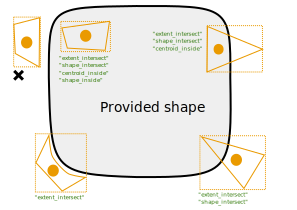
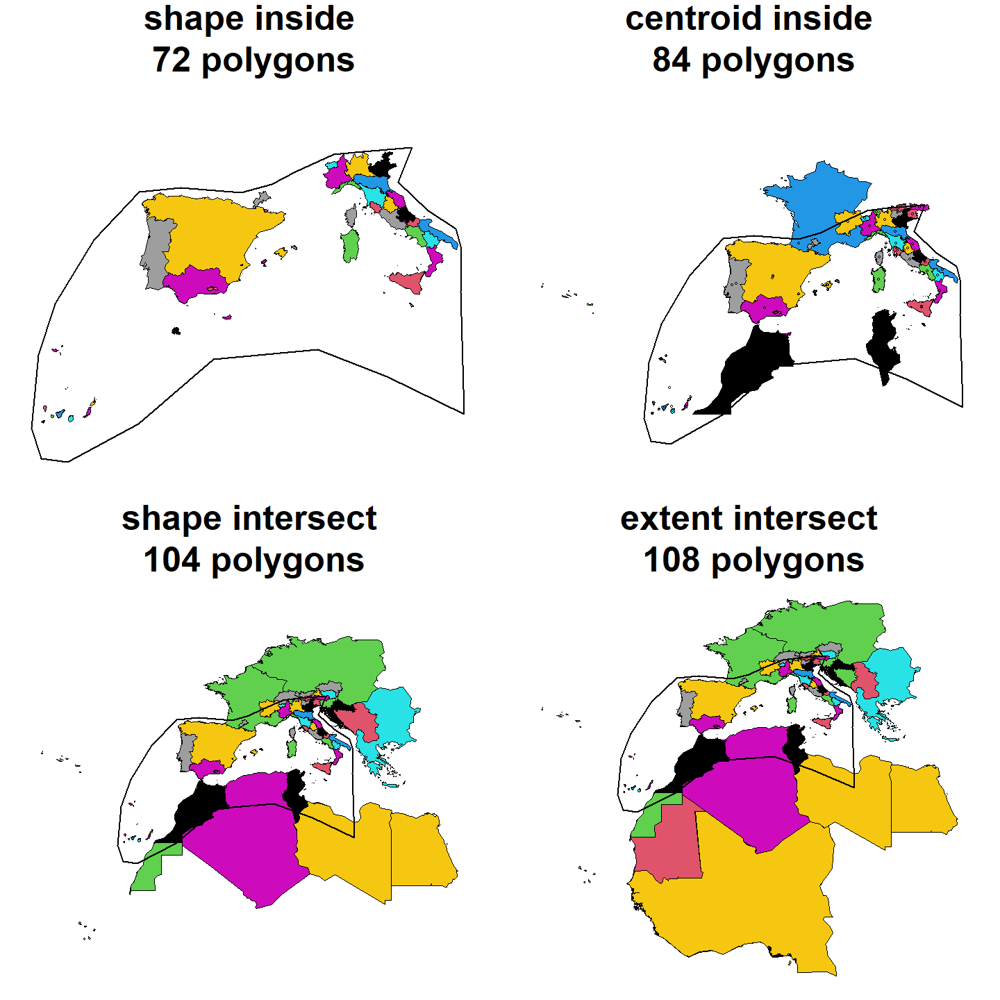
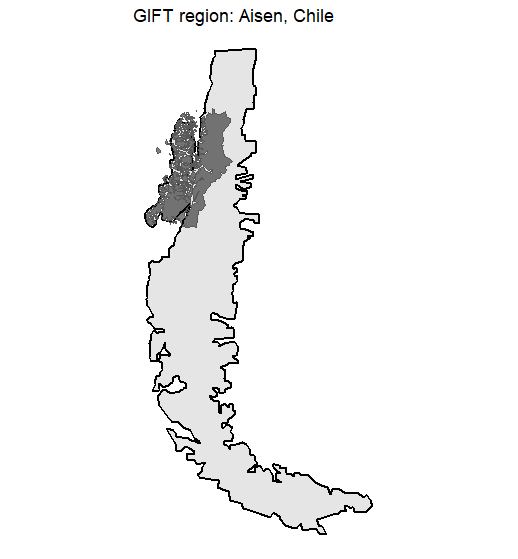
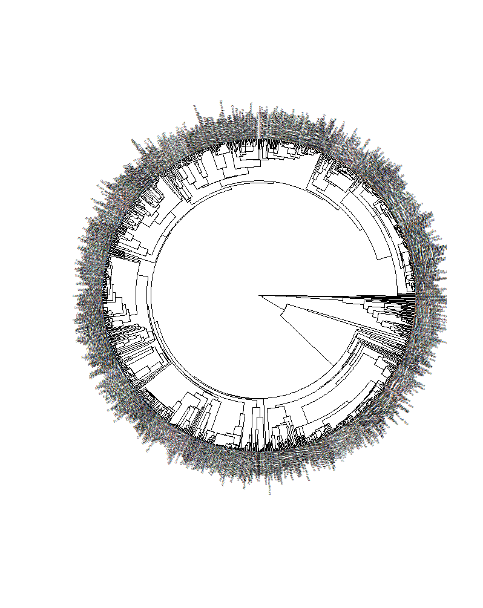

<style>
body {
text-align: justify}
</style>

```{r setup, include=FALSE}

knitr::opts_chunk$set(echo = TRUE, message = FALSE, warning = FALSE,
                      fig.width = 8, fig.height = 8, fig.align = "center")
# Packages --------------------------------------------------------------------
suppressPackageStartupMessages({
  suppressWarnings({
    library("GIFT")
    library("knitr")
    library("kableExtra")
    library("ggplot2")
    library("sf")
  })
})

options(tinytex.verbose = TRUE)
```

```{r gottingen_logo, fig.show = 'hold', out.width = "20%", echo = FALSE}
knitr::include_graphics("../../man/figures/biodiv_gottingen_logo.png")
knitr::include_graphics("../../man/figures/GIFT.png")
```

<br>

This vignette documents some functions and specificities that were not
presented in the
[main vignette](https://biogeomacro.github.io/GIFT/articles/GIFT.html) of the
package. It is mainly intended for advanced users of the GIFT database.

# 1. Versions and metadata for checklists {#section1}

All functions in the package have a `version` argument. This argument allows
you to retrieve different instances of the GIFT database and thus make all
previous studies using the GIFT database reproducible.  For example, the
version used in Weigelt et al. (2020) is `"1.0"`. To get more
information about the contents of the different versions, you can go
[here](https://gift.uni-goettingen.de/about) and click on the Version Log tab.

To access all the available versions of the database, you can run the
following function:

```{r}
versions <- GIFT_versions()
kable(versions, "html") %>%
  kable_styling(full_width = FALSE)
```

The `version` column of this table is the one to use if you want to retrieve
past versions of the GIFT database. By default, the argument used is
`GIFT_version = "latest"` which leads to the current latest stable version of
the database ("2.0" in October 2022).

The `GIFT_lists()` function can be run to retrieve metadata about the GIFT
checklists. In the next chunk, we call it with different values for the
`GIFT_version` argument.

```{r, echo = TRUE, eval = FALSE}
list_latest <- GIFT_lists(GIFT_version = "latest") # default value
list_1 <- GIFT_lists(GIFT_version = "1.0")
```

The number of available checklists was 3122 in the version 1.0 and equals 4475
in the version 2.0.

<br>

# 2. References

When using the GIFT database in a research article, it is a good practice to cite
the references used, and list them in an Appendix. The following function
retrieves the reference for each checklist, as well as some metadata.
References are documented in the `ref_long` column.

```{r}
ref <- GIFT_references()
ref <- ref[which(ref$ref_ID %in% c(22, 10333, 10649)),
           c("ref_ID", "ref_long", "geo_entity_ref")]

# 3 first rows of that table
kable(ref, "html") %>%
  kable_styling(full_width = FALSE)
```

<br>

The next chunk describes the steps to retrieve the publication sources when
you start from specific regions, let's say the Canary islands.  

```{r}
# List of all regions
regions <- GIFT_regions()

# Example
can <- 1036 # entity ID for Canary islands

# What references
gift_lists <- GIFT_lists()

can_ref <- gift_lists[which(gift_lists$entity_ID %in% c(can)), "ref_ID"]

# What sources
kable(ref[which(ref$ref_ID %in% can_ref), ], "html") %>%
  kable_styling(full_width = TRUE)
```

<br>

# 3. Checklist data

The main wrapper function for retrieving checklists and their species
composition is `GIFT_checklists()` but you can also retrieve individual
checklists using `GIFT_checklists_raw()`. You would need to know the
identification number `list_ID` of the checklists you want to retrieve.
<br>
To quickly see all the `list_ID` available in the database, you can run
`GIFT_lists()` as shown in [Section 1](#section1).

<br>
When calling `GIFT_checklists_raw()`, you can set the argument `namesmatched`
to `TRUE` in order to get additional columns informing about the taxonomic
harmonization that was performed when the list was uploaded to the GIFT
database.

```{r, eval = FALSE, echo = TRUE}
listID_1 <- GIFT_checklists_raw(list_ID = c(11926))
listID_1_tax <- GIFT_checklists_raw(list_ID = c(11926), namesmatched = TRUE)

ncol(listID_1) # 16 columns
ncol(listID_1_tax) # 33 columns
length(unique(listID_1$work_ID)); length(unique(listID_1_tax$orig_ID))
```

In the list we called up, you can see that we "lost" some species after the
taxonomic harmonization since we went from 1331 in the source to 1106 after the
taxonomic harmonization. This means that several species were considered as
synonyms or unknown plant species in the taxonomic backbone used for
harmonization.
<br><br>
*Note: the main service used for taxonomic harmonization of species names*
*was The Plant List up to version 2.0 and World checklist of Vascular Plants*
*afterwards.*

<br>

# 4. Spatial subset

In the
[main vignette](https://biogeomacro.github.io/GIFT/articles/GIFT.html), we
illustrated how to retrieve checklists that fall into a provided
shapefile, using the western Mediterranean basin provided with the GIFT R
package.

```{r}
data("western_mediterranean")
```

Here we provide more details on the different values the `overlap` argument
can take, using the `GIFT_spatial()` function. The following figure illustrates
how this argument works:

<br>
```{r, fig.cap = "Figure 1. GIFT spatial", out.width = "50%", echo = FALSE}

```
<br>

We now illustrate this by retrieving checklists falling in the western
Mediterranean basin using the four options available.

```{r, echo = TRUE, eval = FALSE}
med_centroid_inside  <- GIFT_spatial(shp = western_mediterranean,
                                     overlap = "centroid_inside")
med_extent_intersect <- GIFT_spatial(shp = western_mediterranean,
                                     overlap = "extent_intersect")
med_shape_intersect <- GIFT_spatial(shp = western_mediterranean,
                                    overlap = "shape_intersect")
med_shape_inside <- GIFT_spatial(shp = western_mediterranean,
                                 overlap = "shape_inside")
```

```{r, echo = FALSE, eval = FALSE}
med_shape_inside <- GIFT_spatial(shp = western_mediterranean,
                                 overlap = "shape_inside")
```


```{r, echo = TRUE, eval = FALSE}
length(unique(med_extent_intersect$entity_ID))
length(unique(med_shape_intersect$entity_ID))
length(unique(med_centroid_inside$entity_ID))
length(unique(med_shape_inside$entity_ID))
```

We see here that we progressively lose lists as we apply more selective
criterion on the spatial overlap. The most restrictive option being
`overlap = "shape_inside"` with 72 regions, then
`overlap = "centroid_inside"` with 84 regions,
`overlap = "shape_intersect"` with 104 regions and finally the less
restrictive one being `overlap = "extent_intersect"` with 108 regions.
<br>
Using the functions `GIFT_shapes()` and calling it for the entity_IDs retrieved
in each instance, we can download the shape files for each region.

```{r, echo = TRUE, eval = FALSE}
geodata_extent_intersect <- GIFT_shapes(med_extent_intersect$entity_ID)

geodata_shape_inside <-
  geodata_extent_intersect[which(geodata_extent_intersect$entity_ID %in%
                                   med_shape_inside$entity_ID), ]
geodata_centroid_inside <-
  geodata_extent_intersect[which(geodata_extent_intersect$entity_ID %in%
                                   med_centroid_inside$entity_ID), ]
geodata_shape_intersect <-
  geodata_extent_intersect[which(geodata_extent_intersect$entity_ID %in%
                                   med_shape_intersect$entity_ID), ]
```

And then make a map.

```{r, echo = TRUE, eval=FALSE, fig.width = 8, fig.height = 4}
par_overlap <- par(mfrow = c(2, 2), mai = c(0, 0, 0.5, 0))
plot(sf::st_geometry(geodata_shape_inside),
     col = geodata_shape_inside$entity_ID,
     main = paste("shape inside\n",
                  length(unique(med_shape_inside$entity_ID)),
                  "polygons"))
plot(sf::st_geometry(western_mediterranean), lwd = 2, add = TRUE)

plot(sf::st_geometry(geodata_centroid_inside),
     col = geodata_centroid_inside$entity_ID,
     main = paste("centroid inside\n",
                  length(unique(med_centroid_inside$entity_ID)),
                  "polygons"))
points(geodata_centroid_inside$point_x, geodata_centroid_inside$point_y)
plot(sf::st_geometry(western_mediterranean), lwd = 2, add = TRUE)

plot(sf::st_geometry(geodata_shape_intersect),
     col = geodata_shape_intersect$entity_ID,
     main = paste("shape intersect\n",
                  length(unique(med_shape_intersect$entity_ID)),
                  "polygons"))
plot(sf::st_geometry(western_mediterranean), lwd = 2, add = TRUE)

plot(sf::st_geometry(geodata_extent_intersect),
     col = geodata_extent_intersect$entity_ID,
     main = paste("extent intersect\n",
                  length(unique(med_extent_intersect$entity_ID)),
                  "polygons"))
plot(sf::st_geometry(western_mediterranean), lwd = 2, add = TRUE)
par(par_overlap)
```

```{r, fig.cap = "", out.width = "100%",echo = FALSE}

```

<br>

# 5. Remove overlapping regions

GIFT comprises many polygons and for some regions, there are several polygons
overlapping. How to remove overlapping polygons and the associated parameters
are two things detailed in the
[main vignette](https://biogeomacro.github.io/GIFT/articles/GIFT.html).
We here provide further details:

```{r, echo = FALSE, eval = TRUE}
med_shape_inside <- data.frame(
  entity_ID = c(145, 146, 147, 148, 149, 150, 151, 414, 415, 416, 417, 547, 548,
                549, 550, 551, 552, 586, 591, 592, 736, 738, 739, 1033, 1036,
                10001, 10034, 10071, 10072, 10104, 10184, 10303, 10422, 10430,
                10751, 10860, 10978, 11028, 11029, 11030, 11031, 11033, 11035,
                11036, 11037, 11038, 11039, 11040, 11041, 11042, 11043, 11044,
                11045, 11046, 11434, 11455, 11461, 11474, 11477, 11503, 12065,
                12071, 12078, 12230, 12231, 12232, 12233, 12551, 12632, 12633,
                12634, 12635))
```


```{r, message=FALSE, fig.width = 10, fig.height = 6}
length(med_shape_inside$entity_ID)
length(GIFT_no_overlap(med_shape_inside$entity_ID, area_threshold_island = 0,
                       area_threshold_mainland = 100, overlap_threshold = 0.1))

# The following polygons are overlapping:
GIFT_no_overlap(med_shape_inside$entity_ID, area_threshold_island = 0,
                area_threshold_mainland = 100, overlap_threshold = 0.1)
```


```{r chunk_number, eval=FALSE, echo = TRUE}
# Example of two overlapping polygons: Spain mainland and Andalusia
overlap_shape <- GIFT_shapes(entity_ID = c(10071, 12078))
```


```{r, include=FALSE, eval = TRUE}
overlap_shape <- GIFT_shapes(entity_ID = c(10071, 12078))
```


```{r, message=FALSE, fig.width = 10, fig.height = 6}
par_overlap_shp <- par(mfrow = c(1, 1))
plot(sf::st_geometry(overlap_shape),
     col = c(rgb(red = 1, green = 0, blue = 0, alpha = 0.5),
             rgb(red = 0, green = 0, blue = 1, alpha = 0.3)),
     lwd = c(2, 1),
     main = "Overlapping polygons")
par(par_overlap_shp)

GIFT_no_overlap(c(10071, 12078), area_threshold_island = 0,
                area_threshold_mainland = 100, overlap_threshold = 0.1)
GIFT_no_overlap(c(10071, 12078), area_threshold_island = 0,
                area_threshold_mainland = 100000, overlap_threshold = 0.1)
```

<br>

## 5.2. By ref_ID
In `GIFT_checklists()`, there is also the possibility to remove overlapping
polygons only if they belong to the same reference (i.e. same `ref_ID`).  
<br>
We show how this works with the following example:  

```{r, echo = TRUE, eval = FALSE}
ex <- GIFT_checklists(taxon_name = "Tracheophyta", by_ref_ID = FALSE,
                      list_set_only = TRUE, GIFT_version = "3.0")
ex2 <- GIFT_checklists(taxon_name = "Tracheophyta",
                       remove_overlap = TRUE, by_ref_ID = TRUE,
                       list_set_only = TRUE, GIFT_version = "3.0")
ex3 <- GIFT_checklists(taxon_name = "Tracheophyta",
                       remove_overlap = TRUE, by_ref_ID = FALSE,
                       list_set_only = TRUE, GIFT_version = "3.0")

length(unique(ex$lists$ref_ID)) # 369 checklists
length(unique(ex2$lists$ref_ID)) # 364 checklists
length(unique(ex3$lists$ref_ID)) # 336 checklists
```

Asking for checklists of vascular plants, we get 369 checklists without any
overlapping criterion, 336 if we remove overlapping polygons and 364 if we
remove overlapping polygons at the reference level.  
<br>
So what is the difference between the second and third case?  
Let's look at the checklists that are present in the second example but not in
the third.

```{r, eval = FALSE, echo = TRUE}
unique(ex2$lists$ref_ID)[!(unique(ex2$lists$ref_ID) %in%
                             unique(ex3$lists$ref_ID))] # 28 references
```

28 references are in the second example (overlapping regions removed at the
reference level) and not in the third (all overlapping regions removed).
If we look at one of the listed references `ref_ID = 10143`, we see that it is
a checklist for the Pilbara region in Australia. Its `entity_ID` is 10043.
Looking at the GIFT web site, we see that other regions can overlap with it.  
<br>

```{r, include = FALSE, eval = TRUE}
pilbara <- GIFT_shapes(entity_ID = c(10043, 12172, 11398, 11391, 10918))
```

```{r, echo = TRUE, eval = FALSE}
# Pilbara region Australy and overlapping shapes
pilbara <- GIFT_shapes(entity_ID = c(10043, 12172, 11398, 11391, 10918))
```


```{r}
ggplot(pilbara) +
  geom_sf(aes(fill = as.factor(entity_ID)), alpha = 0.5) +
  scale_fill_brewer("entity_ID", palette = "Set1")
```

Since these polygons do not belong to the same `ref_ID`, they are kept if
`by_ref_ID = TRUE` but are removed if `by_ref_ID = FALSE`.

# 6. Species

All the plant species present in the GIFT database can be retrieved using
`GIFT_species()`.  

```{r, eval = FALSE, echo = TRUE}
species <- GIFT_species()
```

To add additional information, like their order or family,
we can call `GIFT_taxgroup()`.

```{r, eval = FALSE, echo = TRUE}
# Add Family
species$Family <- GIFT_taxgroup(
  as.numeric(species$work_ID), taxon_lvl = "family", return_ID = FALSE, 
  species = species)
```

Order or higher levels can also be retrieved.

```{r, eval = FALSE, echo = TRUE}
GIFT_taxgroup(as.numeric(species$work_ID[1:5]), taxon_lvl = "order",
              return_ID = FALSE)
GIFT_taxgroup(as.numeric(species$work_ID[1:5]),
              taxon_lvl = "higher_lvl", return_ID = FALSE,
              species = species)
```

<br>

As mentioned above, plant species names may vary from the original sources they
come from to the final `work_species` name they get, due to the taxonomic
harmonization procedure. Looking up a species and the different steps of
taxonomic harmonization is possible with the `GIFT_species_lookup()` function.

```{r, eval = FALSE, echo = TRUE}
Fagus <- GIFT_species_lookup(genus = "Fagus", epithet = "sylvatica",
                             namesmatched = TRUE)
```

In this table, we can see that the first entry *Fagus silvatica* was later
changed to the accepted name *Fagus sylvatica*.

<br>

## 6.2. Retrieve work_IDs for external species list

```{r, echo = TRUE, eval = FALSE}
sp_list <- c("Anemone nemorosa", "Fagus sylvatica")

gift_sp <- GIFT_species()

sapply(sp_list, function(x) grep(x, gift_sp$work_species))
gift_sp[sapply(sp_list, function(x) grep(x, gift_sp$work_species)), ]

# With fuzzy matching
# library("fuzzyjoin")
# library("dplyr")
sp_list <- data.frame(work_species = c("Anemona nemorosa", "Fagus sylvaticaaa"))

fuzz <- stringdist_join(sp_list, gift_sp,
                        by = "work_species",
                        mode = "left",
                        ignore_case = FALSE, 
                        method = "jw", 
                        max_dist = 99, 
                        distance_col = "dist") 

fuzz %>%
  group_by(work_species.x) %>%
  slice_min(order_by = dist, n = 1)
```


# 7. Taxonomy

The taxonomy used in GIFT database can be downloaded using `GIFT_taxonomy()`.

```{r, eval = FALSE, echo = TRUE}
taxo <- GIFT_taxonomy()
```

<br>

# 8. Overlap_GloNAF tables (and others)

Since other global databases of plant diversity exist and may be based on
different polygons, we provide a function `GIFT_overlap()` than can look at the
spatial overlap between GIFT polygons and polygons coming from other databases.
<br>
So far, only two resources are available: `glonaf` and `gmba`.
`glonaf` stands for [Global Naturalized Alien Flora](https://glonaf.org/index.php/a-brief-history-of-glonaf/) and
`gmba` for
[Global Mountain Biodiversity Assessment](https://www.gmba.unibe.ch/).

`GIFT_overlap()` returns the spatial overlap in percent for each pairwise
combination of polygons between GIFT and the other resource.

Let's illustrate this with the GMBA shapefile.

```{r}
gmba_overlap <- GIFT_overlap(resource = "gmba")

kable(gmba_overlap[1:5, ], "html") %>%
  kable_styling(full_width = FALSE)
```

We see that two overlap columns are returned: `overlap12` and `overlap21`.  
The first column returns the overlap between the GIFT region and the other
resource. The second column returns the overlap between the other resource and
the GIFT region.  
For example, if we look at the polygon 11861 of GIFT:  

```{r}
gmba_overlap[which(gmba_overlap$entity_ID == 11861 &
                     gmba_overlap$gmba_ID == 731), ]
```

The corresponding region is the Aisen province in Chile and it overlaps at 95%
with the GMBA polygon number 731.  
At the same time the GMBA polygon 731 only overlaps at 13% with the Aisen
province of Chile.  
This is because the corresponding mountain region is larger than the GIFT
region and encompasses it as we can see on this plot (the dark polygon is the
GIFT region):  

```{r, fig.cap = "", out.width = "50%",echo = FALSE}

```

<br>

# 9. Plotting phylogeny for a specific region

We here want to plot the phylogenetic tree of native plant species occurring
in Tenerife island.

```{r, eval = FALSE, echo = TRUE}
# List table
gift_list <- GIFT_lists()
# Tenerife data for the following list_IDs: 150, 14110, 14228

# Retrieve the lists
tenerife <- GIFT_checklists_raw(list_ID = c(150, 14110, 14228))

# Extract unique native species only
tenerife_sp <- tenerife[which(tenerife$native == 1), ] %>% 
  dplyr::select(work_species) %>% 
  distinct(.keep_all = TRUE)

# Harmonizing species names between the species table and the phylogeny
tenerife_sp$work_species <- gsub(" ", "_", tenerife_sp$work_species,
                                 fixed = TRUE)

# Phylogeny
phy <- GIFT_phylogeny()

# Dropping tips
tenerife_phy <- ape::keep.tip(
  phy,
  tip = phy$tip.label[(phy$tip.label %in% tenerife_sp$work_species)]) 

plot(tenerife_phy, type = "fan", cex = 0.2)
```

```{r, fig.cap = "", out.width = "50%",echo = FALSE}

```

# References

Denelle, P., Weigelt, P., & Kreft, H. (2023). GIFT—An R package to access the
Global Inventory of Floras and Traits. *Methods in Ecology and Evolution*,
00, 1–11.
[https://doi.org/10.1111/2041-210X.14213](https://doi.org/10.1111/2041-210X.14213). 
  
Weigelt, P., König, C. & Kreft, H. (2020) GIFT – A Global Inventory of Floras
and Traits for macroecology and biogeography. *Journal of Biogeography*, 
[https://doi.org/10.1111/jbi.13623](https://doi.org/10.1111/jbi.13623).
